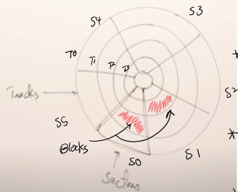
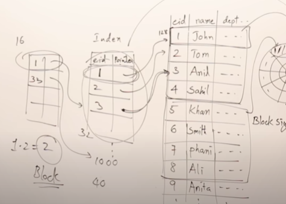
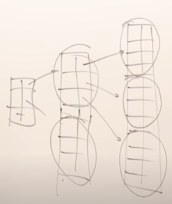

# B Trees and B+ Trees

- Assume block size is 512 bytes in this notes

---

## Disk Structure

---

- Any location on the disk can be addressed using 
  - **track #** and **sector #**
  - 

- **Block address** = (Track No. , Sector No. )

- Disk read and write in terms of blocks

- Each byte in the block can has its own address

  - **byte offsets**

  - ```
    ----------------------------------------
    |  |  |  ...                        |  |
    ----------------------------------------
     ^                                    ^
     |                                    |
    byte 0                               byte 511
    ```

- We can refer any one byte on the disk by 

  - first block address
  - and then byte offset

- Data in the disk is stored in terms of blocks.

- When a program need to access data in the secondary storage,

  - the data in the disk need to be brought into the memory.
  - any change made on the data will be reflect from the memory back to the secondary storage.

- Organizing the data in the memory that is directly used by a program is **data structure**.

- Organizing the data in the disk that can be utilize efficiently is **DBMS**.

---

## Data Organization In Disk

---

- How data is organized in the disk in the form of database
- Table Definition (Example)
  - eid - 10 bytes
  - name - 50 bytes
  - dept - 10 bytes
  - sedion - 8 bytes
  - add - 50 bytes
  - Total size is 128 bytes
  - Each row size in the table take 128 bytes
- Number of records / rows per block = 512 bytes / 128 bytes = 4
  - We can store four rows in a table into one block
- Let say there are 100 records in a table, then it requires 25 blocks to store this table.
- I/O cost for accessing one block : 25 blocks (without any search algorithm)

---

## Indices

---

- Create an entry for each record (***dense index***)
  - consists of an index and (record) pointer 
    - a pointer that points to a record in a block of disk
- Indices are also stored in the disk
- Let say the index is created using eid from the previous table definition
- How much storage of a index table $A$ take ?
  - eid = 10 bytes
  - record pointer = 6 bytes
  - 100 records => 100 index entries
  - number of entries / block = 512 / 16 = 32
  - 100 entries requires 4 blocks of storage
- Every time need to access a record, search for the index and return the record pointer
- For 100 entries, to access one record, the I/O cost is 4 blocks (index table) + 1 block (record)
- 

---

## Multilevel Indexing

---

- Performance of having one index table for an entire table will degrade as number of records increase
  - more index entries, more blocks to store = increase in I/O costs
- Constructing a higher level index table on top of a lower level index table
  - Notice that it's not the case of 
    - mapping one index entry in a index table with another index
    - This only creates redundancy and barriers.
  - ***Sparse Index***
- 
- One high level index entry map a list of lower level indices
  - one high level index map 1 block of table $A$ index entries
    - 1 high level index => 32 index entries in table $A$
- Each time adding one high level of index table on top of another low index table
  - it reduces the I/O costs (blocks access, pages transfer, etc.)
- This is how B tree and B+ tree originate.

---

## M-way Search Tree

---

- Recall binary search tree (BST)
  - Each node have 1 key and 2 child nodes
  - Can a tree have more than 1 key and more than 2 child node ?
    - M-way search tree
- $M$ indicates the number of child node for each node
  - $M-1$ is the number of keys
  - $K_1<K_2<...<K_{m-1}$
- Example : 3 way ST
  - 2 key and 3 child nodes

