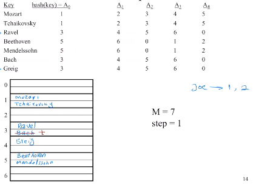

# Hashing

- Given a search key, return its location in the file in close to one I/O.
- Support equality searches in one disk access.
  - no support range search

---

## Method

---

- Build a hash table in a file
- Hash keys into addresses of page files

  - a key $\to$ an address random of page, and fetch / store it in the page

---

## Hash Function

---

- Input : a field of a record; usually its key $K$ (student id, name, ...)
- Compute index function $H(K)$
  - $H(K): K\to A$
  - to find the address of $K^*$
- $H(K)=A$ is the address of the record (or index entry) with key $K$
- More random the hash function is, the better
  - Distribute the keys evenly across different places. 

---

### Issues

---

- Key space, the set of all possible values for keys
- Address space ($N$)
  - The set of all storage units
  - Physical location of file
- In general
  - Address space must accommodate all records in file
  - Address space is usually much smaller than key space
- Collision
  - Two different keys may be hashed into the same address (pages, etc.)
    - For a (page) file, it's less than an issue until a (page) file is full.

  - To deal with it, two ways:
    - choose hashing functions that reduce collisions
    - rearrange the storage of records to reduce collisions

---

### Choice of Hash Function

---

- Perfect hash function
  - 1-to-1 : No alias
  - Key space = Address space
- Not feasible for large and active files
  - Minimize collisions
  - Relatively smaller address space
- Trade-off
  - The larger the address space, the easier it is to avoid collisions
    - but the worse the storage utilization becomes

---

### A Hash Function

---

- Convert the key to a number, key $\to K$
- Compute an address from the number
  - address = $K$ mod $M$
- Choose $M$ to be a prime number

---

### Collisions Solution

---

#### Static Methods - Linear probing

---

- Address space is fixed.
- Map each key into a sequence of addresses $A_0, A_1, A_2, ...$
- For each key, generate a sequence of addresses $A_0, A_1, A_2, ...$ 
  - If $A_i$ is not full, store it. Otherwise, store it in $A_{i+1}$ if $A_{i+1}$ is not full. Repeat the above steps if $A_{i+1}$ is full.
  - When fetching, need to search all addresses until it find the actual result or reach an empty address (not exists).
  - Example : 
    - $A_0$ = hash(key) mod $M$
    - $A_{i+1} = [A_i + step]$ mod  $M$ if $A_{i}$ is full
    - M : file size (max # of addresses)
    - step : a constant

- Deletion : after delete a record, put an symbol to indicate
  - insert : a empty place that can be reused
  - search : need to continue search until reach an empty place
    - cannot be treated as an empty place

- 
- Performance degradation as more rows are added.
- Waster of space as more rows are deleted
- These are problems for all static methods
- Solutions
  - Reorganization

---

#### Dynamic Methods - Extendable Hashing

---

- The address space is changed dynamically.
  - address space can grow and shrink
- The has function is adjusted to accommodate the change.
  - hash function adjust when address space grow / shrink
- A common family of hash functions
  - $h_k$(key) = $h$(key) mod $2^k$ (use the last $k$ bits of $h$(key))
    - $k$ increase when address space increase, decrease when address space decrease.
  - At any given time a unique hash, $h_k$, is used.

- Instructions => check hashing example

---

## Indexing in SQL

---

- Create an index on a column to increase query speed
  - `CREATE INDEX authidx ON book (author)` in SQLite
  - usually is B+ tree index
  - An unclustered (dense) index
- Create an clustered index
  - By default, only *unique* and *primary key* columns are indexed in SQLite
    - An index is usually created on primary key by default for most of the database
  - `CREATE TABLE book (id, ..., PRIMARY KEY (Id)) WITHOUT ROWID` in SQLite
  - SQLite will create a row id for every row (sequential order) if no `WITHOUT ROWID`

- 

---