# The Entity-Relationship Model
- The "world" is described in terms of
  - *entities*
  - *relationships*
  - *attributes*
------

## ER Model Basics

------

### Entity

------

- It is **distinguishable** object

  - person, thing, concept

- *Entity set* is a set of entities of the same *type*.

- Examples

  - students registered at UofA
  - flights offered by Air Canada

- Graphical representation

  

------

### Relationship

------

- It represents the fact that certain *entities* are related to each other.

- *Relationships set* is a set of relationship of *same type*.

- Examples

  - students enrolled in courses
  - cars registered to owners

- Graphical representation

- Two entities can have more than one relationship

  

------

### Attribute

------

- It describes a property of an *entity* or a *relationship*

- Example

  - student : id, name , major, ...
  - car : VIN, year, model, ...
  - flight : No, source, destination, ...

- **Underscore** to represent key in graphical representation.

- Graphical representation

  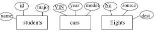

------

### Key

------

- A **minimal** set of attributes that **uniquely identifies** each *entity* in an *entity set*
- Attributes of relationships - example
  - student enrolled in a course : year, semester, grade
  - book on loan : loan date, due date
- A relationship **does not** have a key

------

### Role

------

- The function of an *entity set* in *relationship set*.

- Role labels are needed whenever an *entity* has **multiple functions** in a *relationship set*.

  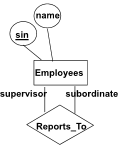

------

## Constraints and Complications

------

### Type of lines and Arrow

------

- Normal lines - no constraint

- Thick lines - one entity and more than one entities (participation constraint)

- Arrow - key constraint

  

- (Normal lines +) Arrow - one entity is mapped into only one entity in another set (the direction of the arrow), or no entity is mapped

- Thick lines + Arrow - **For all** entities in one set, each entity is mapped into **only one** entity in another set (the direction of arrow). **No entity** is not mapped into **only one** entity in another set.

------

### Binary Relationship Types

------

- Many-to-Many : no constraint

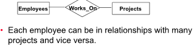

- Many-to-One : each entity can only be mapped into at most one entity in another set

  

- One-to-One : each entity in set A is mapped into at most one entity in set B and each entity in set B is mapped into at most one entity in set A

  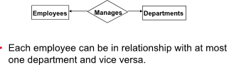

------

### Ternary Relationships

------

- Not common, require 3 different set of entities

  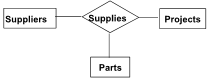

- Supplier **s** supplies part **p** for project **r**
- Ternary Relationships cannot be replaced by binary relationship by establish an relationship between each set. 
  - Binary relationship is not sufficient and cause ambiguity.
- Suppliers **s** does not necessary supply part **p** for project **r**, maybe other thing
- Part **p** is used for project **r** but part **p** is not necessarily supplied by suppliers **s**

------

### Binary Relationship and Ternary Relationship

------

-  It is not allow an entity to have relationship with a specific entity in another set more than once.
  - Binary relationship
- Binary relationship describe an relationship between two entities in less clear way.
- To describe binary relationship more specifically and clear, use ternary relationship.
- Binary relationship is less clear to describe the detail of the relationship between entities but it is more flexible to change and modification on relationship if it requires more detailed specification on a relationship
-  Ternary relationship is less flexible to change and modification on the relationship between entities because of constraints.
   -  **Remark** : **all** three entities **must be** present

------

#### Example

------

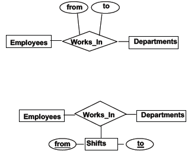

- Can an employee work in two or more shifts in the same department ?
  - first : No
  - second : Yes

- For ternary relationship modeling, an shift (entity) must be specified when describe John works in grocery department.

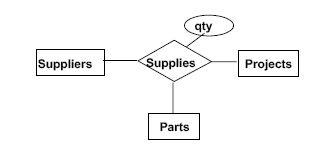

- Represent using binary relationships
  - supplier s “supplies” part p
  - part p “used_in” project r
  - Supplier s “supplies_to” project r
- But no combination of binary relationships implies that part p supplied
  by supplier s is used in project r

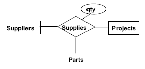

- New constraint : each part is supplies by a unique supplier
  - not possible
  - An arrow from supplies to supplier would mean each
    parts/projects pair is in relationship with at most one
    supplier

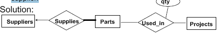

------

### Participation Constraints

------

- Example : The participation of Projects in Supervises is said to be *total* (indicated by the thick line)

  - Force each project to have a supervisor

- Every  *pid* value in Projects must be in a "supervises" relationship with a *sin* (not null) of an employee

  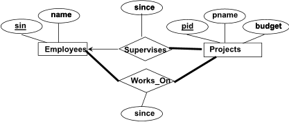

------

### Set-Valued Attributes

------

- Attribute value can be a set (in contrast to relational model)

- Example

  - Each employee can have one or hobby

  

------

### Weak entity

------

- A *weak entity* models an entity which is "part-of" an **owner entity**, and it cannot be uniquely **identified without** the primary key of the owner entity

- Relationship is One-to-Many

- *Weak entity* set has **total participation** in identifying relationship set

- Think about *weak entity* as a attribute that cannot be described by a single value of the **owner entity**

- Dotted underline indicates the keys of *weak entity*
  - Keys of *weak entity* are not unique
  
  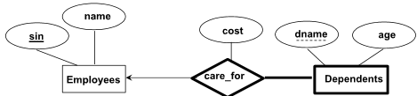

------

### ISA Hierarchy

------

-  A new entity set as the *union* of two or more entity sets

- Attributes and relationships common to all lower-level entity sets are moved to the higher-level entity set.
  - Lower-level entity sets inherits the attributes and relationships in the high-level entity set

- Also consider forming a derived entity set by taking a subset of given entity set -> Specialization

  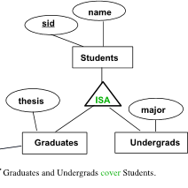

------

#### Properties of ISA

------
- Inheritance
  - Attribute of super type are attributes of subtype
  - Key of super type is key of subtype
  - Relationships of super type are relationships of subtype

- Transitivity - Hierarchy of ISA
  - Undergrad student is subtype of Student, Student is subtype of Person, so Undergrad student is also a subtype of Person

------

#### ISA Constraints
- Covering constraints
  - Does every Students entity also have to be Graduates or an Undergrads entity ? (default : no)
- Overlap constraints
  - Can Joe be a Graduates as well as an Undergrads entity ? (default : disallowed)

------

## Entity vs. Attribute

------

#### Example

------

- Should *address* be an attribute (of Students) or an entity (connected to Students by a relationship)?
- Depends on 
  - (a) its use 
  - (b) its relationships with other entities
- Ask four questions
  - is it an object that we want to keep information about (independent of Students) ?
  - does it participate in a relationship with an entity other than
    students ?
  - are there many students with no addresses ?
  - can several students share the same address ?
- A positive answer to **one or more** of those questions implies address better be modeled as an entity.

------

## Remark

------

- Avoid having duplicate records in all fields
- Avoid complex model, keep model simple and sufficient for use
- Avoid modeling things that are not specified in the spec
- **one or more** - total participation, thick line
- **each** - total participation, thick line
- entity A [action word] entity B - a relationship between entity A and entity B

------

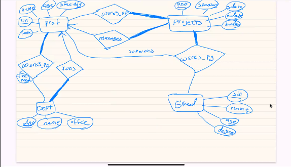

exercise. change the ER such that when a grad student work on a project, a proft may supervise that work
