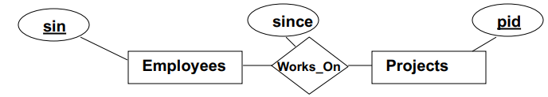
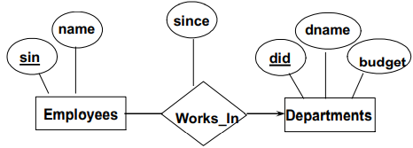
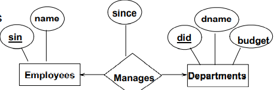
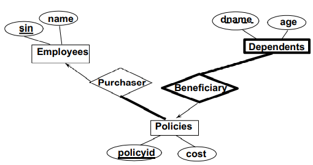

# ER to Relational Mapping


## Relationship Sets to Tables

------

- Attributes of the relation (table) :
  - Key of every participating entity set (as foreign keys)
  - All descriptive attributes

------

### Example 1

------

  - sin is unique and PK of Employees
  - pid is unique and PK of Projects
  - sin and pid are PKs of Works_On table but sin and pid is reference from Employees and Projects



```sqlite
CREATE TABLE Works_On (
	sin CHAR(11),
    pid INTEGER,
    since DATE,
    PRIMARY KEY (sin, pid), 
    FOREIGN KEY (sin) REFERENCES Employees,
    FOREIGN KEY (pid) REFERENCES Projects
)
```

------

## Relationships with Key Constraints

------

- Constraints are focus on a single table

------

### Example 1

------



- Constraint : each employee works in at most one department

```sqlite
CREATE TABLE Works_In (
	sin CHAR(11),
    did CHAR(3),
    since DATE,
    PRIMARY KEY (sin),
    FOREIGN KEY (sin) REFERENCES Employees,
    FOREIGN KEY (did) REFERENCES Departments
)
```

- Better mapping
  - Since each employee can work in at most one department, we  could instead combine Works_In and  Employees.
  - PK in Employees can enforce each employee can only at most one department
    - It is not allow have two rows with same `sin` although `did` is different because PK is `sin`

```sqlite
CREATE TABLE Emp_Works(
	sin CHAR(11),
	name CHAR(20),
	did CHAR(3),
	since DATE,
	PRIMARY KEY (sin),
	FOREIGN KEY (did) REFERENCES Departments
)
```

------

### Example 2

------



- Combine Manages with Departments or combine manages with Employee
  - Combine Manages with Departments is better because since the number of departments is not very large
  - Not every employee manages a department -> `null` value
- This type of relationship involves apply constraints from two table : **currently it cannot** be captured (discuss later) 

------

## Participation Constraints

------

- Participation constraint can be enforce by using `NOT NULL`

## Exercises

------

### Exercises 1

------



```sqlite
CREATE TABLE Purchaser_Policies (
	policyid char(9),
    cost int,
    sin char(9),
    PRIMARY KEY (policyid),
    FOREIGN KEY (sin) REFERENCES Employees
)

CREATE TABLE Dep_Ben (
	dname char(20),
    age int,
    policyid char(9),
    PRIMARY KEY (dname, policyid)
    FOREIGN KEY (sin) REFERENCES Policies ON DELETE CASCADE
)
```


------

```sqlite
CREATE TABLE project (  -- merge with Manges
	pid int,
    sponsor char(20),
    st_date date,
    end_date date,
 	mgr char(9) NOT NULL,
    PRMIARY KEY (pid),
    FOREIGN KEY (mgr) REFERENCES prof
    -- Although column "mgr" is not in prof table,
    -- it assumes that PK of prof table is refered (sin)
)

CREATE TABLE Works_pp (
	sin char(9),
    pid int,
    PRIMARY KEY (sin, pid),
    FOREIGN KEY (sin) REFERENCES prof,
    FOREIGN KEY (pid) REFERENCES projects
)

CREATE TABLE Works_pd (
	sin char(9),
    pid int,
    pc_time date
    PRIMARY KEY (sin, pid),
    FOREIGN KEY (sin) REFERENCES prof,
    FOREIGN KEY (pid) REFERENCES project
)

-- Works_gp cannot completely capture 
-- E.g project (total-participate) -> Works_gp -> Graduate
CREATE TABLE Works_gp ( 
	pid int,
    stu.sin char(9),
    prof.sin char(9),
    PRIMARY KEY (pid, stu.sin, prof.sin),
    FOREIGN KEY (pid) REFERENCES project
    FOREIGN KEY (stu.sin) REFERENCES project
    FOREIGN KEY (prof.sin) REFERENCES project
)
```

