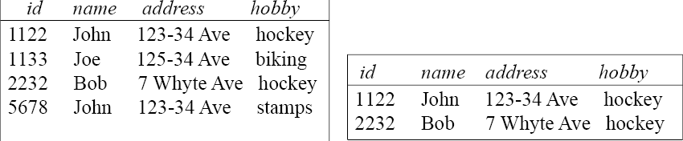
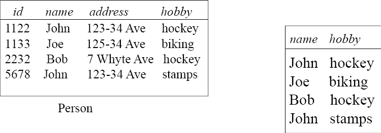
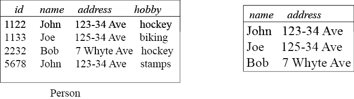
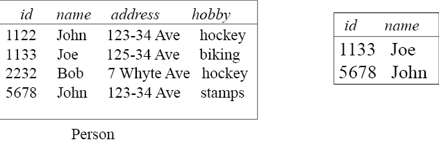
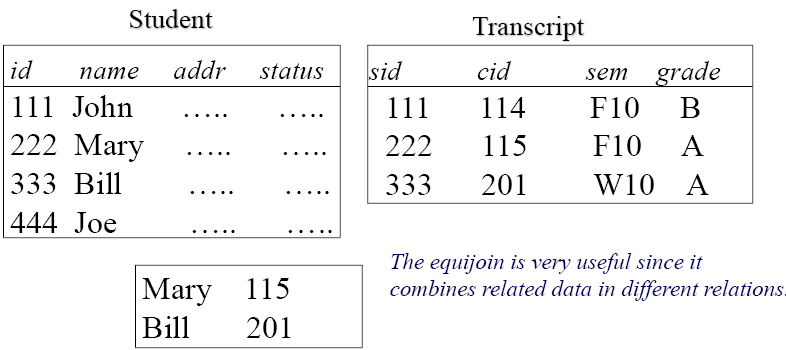
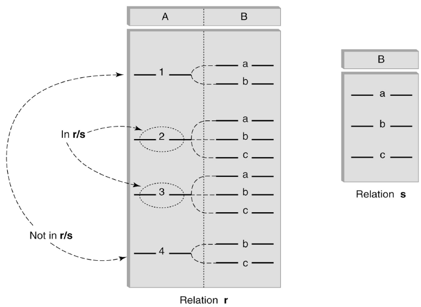

# Relational Algebra

## Selection

------

- $\sigma_{condition}$ (relation) : Select rows that satisfy the condition

------

### Selection Condition

------

- Operators : $<$, $\leq$, $\geq$, $>$, $=$, $\neq$
- Simple selection condition :
  - `<attribute> operator <constant>`
  - `<attribute> operator <attribute>`
- `<condition> AND <condition>`
- `<condition> OR <condition>`
- `NOT <condition>`

------

#### Example

------

- $\sigma_{hobby} =$ 'hockey' (Person)

- $\sigma_{id>1000 \thinspace OR \thinspace hobby='hockey'}$ (Person)
- $\sigma_{id>3000 \thinspace AND \thinspace id<=3500}$ (Person)
- $\sigma_{NOT(hobby='hockey')}$ (Person)
- $\sigma_{NOT(hobby\neq'hockey')}$ (Person)

------

## Projection

------

- $\pi_{attribute \thinspace list}$ (relation) : Project on (or pick) a subset of columns

------

### Example

------

- $\pi_{name,hobby}(Person)$

- $\pi_{name,address}(Person)$

- $\pi_{id, \thinspace name}(\sigma_{hobby='stamps' \thinspace OR \thinspace hobby='biking'(Person)})$

------

## Cartesian Product

------

- $R\thinspace \cross \thinspace S \thinspace = \thinspace \{ <r,s> |r \in R \thinspace and \thinspace s\in S \}$
  - $R \thinspace \cross S$​  is the set of all concatenated tuples $<x,y>$, where
    $x$ is a tuple in $R$ and $y$ is a tuple in $S$
  - Relations don’t have to be union-compatible
- $R \thinspace \cross \thinspace S$ can be huge (and expensive to compute)
  - Factor of two in the size of each row
  - Quadratic in the number of rows

------

## Renaming

------

-  $\rho_{x(A1,A2,...A_n)}$ expr
   -  *expr* returns a relation
   -  $A1,A2,...A_n$ columns name of the renamed table
   -  Rename the resulting relation to x with the first column in the result relation to $A_1$, the second to $A_2$, etc.

------

### Example

------

- Let $R(a,b)$ be a relation with two columns
- $\rho_{p,q,r,s)R \cross R$ is a relation with two columns
- $\rho_(p, q, r, s)R \cross R$ is a relation with 4 columns p, q, and s.
- Common usage
  - To clean up the result
  - To prepare the result for next operation

- `Transcript (sid, cid, sem, grade)`
- `Teaching (pid, cid, sem)`
- `Transcript` $\cross$ `Teaching`

$$
\rho_{(sid,cid1)}(\pi_{sid,cid}(Transcript)) \cross \rho_{pid,cid2}\pi_{pid,cid}(Teaching)
$$

- The result is a relation with 4 attributes : `sid`, `cid1`, `pid`, `cid2`

- $\rho_{(sin1)} \pi_{sin}(emp) \cross \rho_{(sin2)} \pi_{sin}(teach) = \rho_{(sin1, sin2)}(\pi_{sin}(emp)  \cross \pi_{sin}(teach))$

------

## Set Operation

------

- Relation ~ a set of tuples
- Operations: $\cup$, $\cap$, - (set difference)
- ***Union compatible relations*** is defined (or meaningful) between relations
  that have the same structure
- All set operations are ***derived operator***.

------

### Union Compatible Relations

------

- Two relations are ***union compatible*** if
  - Both have the **same number of columns**
  - **Names of attributes** are the **same** in both
  - Attributes with the **same name** in both relations have the same domain
- Union compatible relations can be combined using *union*, *intersection*, and *set difference*

------

## Join (Derived Operator)

------

- A (*general* or *theta*) join of $R$ and $S$ is the expression $R\bowtie_{join-condition}S$

  - *join-condition* is *conjunction* of terms : $A_i$ *oper* $B_i$

    -  $A_i$ is an attribute of $R$;

    - $B_i$ is an attribute of S;
    - *opera* is one of =, <, >, $\geq$, $\neq$, $\leq$

- Equivalent to $\sigma_{join-condition'}(R\cross S)$

  - join-condition = *join-condition'*

- Known problem : If R and S have attributes with the same name, then the Cartesian product is not well-defined

  - Rename attributes prior to forming the product and use new names in *join-condition´*.
  - Common attribute names are qualified with relation names in the result of the join

------

### Join Example

------

- `Employee(name, id, salary, mngrId)`
- `Manager(name, id, salary)`

$$
\pi_{Employee.name}(Employee\bowtie_{mngrId=manager.id \thinspace AND \thinspace Employee.salary > Manager.salary} Manager)
$$

- The join yields a table with attributes
  - `Employee.name`
  - `Employee.id`
  - `Employee.salary`
  - `mngrId`
  - `Manager.name`
  - `Manager.id`
  - `Manager.salary`

------

### Equijoin - Example

------

- Join condition is a conjunction of *equalities*.

$$
\pi_{name,cid}(Student\bowtie_{id=sid}\sigma_{grade='A'}(Transcript))
$$

------

## Natural Join

------

- Special case of equijoin :
  - join condition equates *all* and *only* those *attributes* with the **same name** (condition doesn’t have to be explicitly stated)
  - duplicate columns eliminated from the result

- More generally : $R\bowtie S=\pi_{attr-list}(\sigma_{join-cond}(R\cross S))$
  - *attr-list* = attributes (R) $\cup$ attributes(S) (no duplicates)
  - *join-cond* has the form of $A_1=A_1$ AND ... AND $A_n = A_n$
  - ${A_1 ... A_n}$ = attributes(R) $\cap$ attributes(S)

------

### Example

------

- List the id's of students who took at least two different courses
- Tables
  - `Transcript (sid, cid, sem, grade)`
- Solution ?

------

## Division (Derived Operator)

------

- Finds tuples in one relation, ***r***, that match *all* tuples in another relation, ***s***
  - ***r*** $(A_1, \thinspace ..., A_n, \thinspace B_1, ..., \thinspace B_m)$
  - ***s*** $(B_1 \thinspace ... \thinspace B_m)$
  - $r/s$, with attributes $A_1,\thinspace...\thinspace A_n$, is the set of all tuples $<a>$ such that for every tuple $<b>$ in $s$, $<a,b>$ is in $r$

- $R(a,b,c,d)\thinspace / \thinspace S(c,d)$ is
  - Return a table with columns (a, b) and it includes all <a,b> tuples in R that appear with all <c,d> values from S

- Division can be expressed in terms of projection, set difference, and cross-product.

------

### Example

------

- List the Ids of students who have passed ***all*** courses taught in winter 2010

- *Numerator* :

  - *sid* and *cid* for every course passed by every student

    $\pi_{sid, \thinspace cid}(\sigma_{Grade\neq'F'}(Transcript))$

- *Denominator* :

  - *cid* of all courses taught in winter 2010

    $\pi_{cid}(\sigma_{Sem='W10'}(Teaching))$

- Result is *numberator* / *denominator*