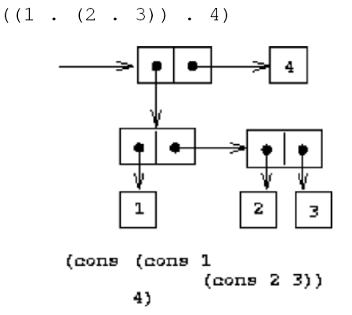
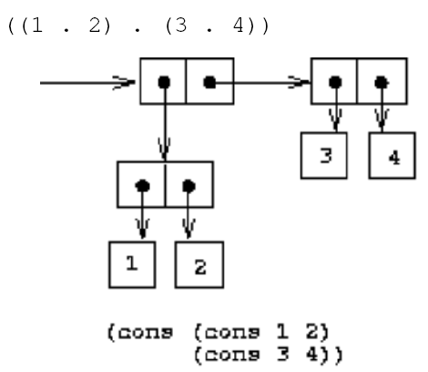
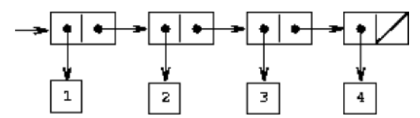
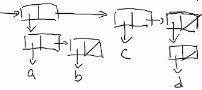
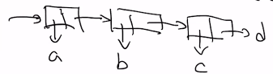
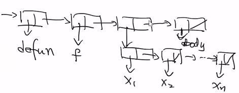

# Symbolic Expressions

```lisp
'(A . B)
(setq l '(A .B))
(car l)
;A
(cdr l)
;B
('a . (b . c))
;(A B . C)
(cons 'a (cons 'b 'c))
;(A B . C)
```

- The “universal” data structure for Lisp
- A generalization of atoms and lists
- Adds the notion of a “dotted pair” (x . y)

------

### Example 1

------



------

### Example 2

------



------

### Example 3

------



```lisp
;(1 2 3 4) "simplest form" (fewest dots)
;(1 . (2 3 4))
;(1 . (2 . (3 4)))
;(1 . (2 . (3 . (4))))
;(1 . (2 . (3 . (4 . nil)))) "full dotted pair form"
```

------

## The Simplest Form

------

- Least amount of dots
- Rule of thumb : can eliminate a dot followed by an open parenthesis
- Also eliminate the matching open / closing parentheses
  - also works for `nil` if write it as `()`

------

## Machine Representation

------

```lisp
'((a b) c (d))
```



```lisp
'((a . b) (c . d)) 
; in this case, dot notation need to in the expression
; cdr yield an atom instead of a list
```

```lisp
'(a b c . d)
; (a . (b . (c . d)))
; every use cons -> a dotted notation between two arguments
```



```lisp
(defun f (x1 ... xn) body)
```


