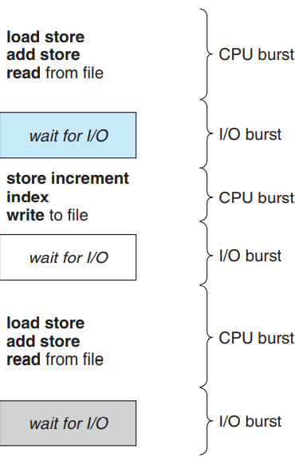
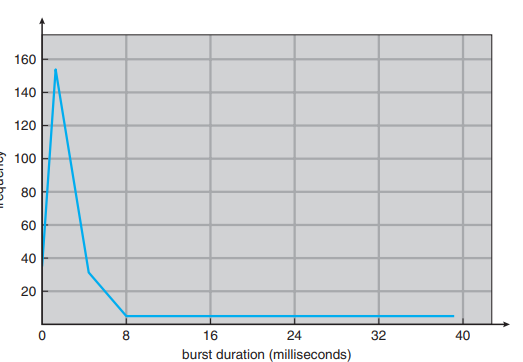

# CPU Scheduling

## Basic Concepts

---

- Objective of multiprogramming
  - have some process running at all times => maximize CPU utilization
  - exploit CPU time of which a process is (I/O) waiting
    - OS take away the CPU and give it to another process

---

### CPU-I/O Burst Cycle 

---

- Process alternates between two states
  - a cycle of CPU execution
  - I/O wait
- Process execution begins with a **CPU burst**, 
- then is followed by an **I/O burst** , a CPU burst, a I/O burst, ... (repeated pattern) until termination
- 

- The durations of CPU bursts can be generalized by a frequency curve

  

- large number of short CPU bursts and a small number of long CPU bursts.
- I/O-bound and CPU-bound program (page 263)

---

### CPU Scheduler

---

- Data structure for a CPU scheduler (page 263)
  - can be different based on scheduling algorithms
- PCBs

---

### Preemptive Scheduling

---

- CPU-scheduling make decisions under four circumstances
  - determines scheduling scheme
- Difficulty and cautions using preemptive scheduling (page 264)

---

### Dispatcher

---

- Gives control of the CPU to the process selected by the short-term scheduler
- Functions
  - switching context
  - switching to user mode
  - jumping to the proper location in the user program to restart that program
- Must be fast
- **Dispatch latency** : time it take for it to stop one process and start another running

---

## Scheduling Criteria (Page 265 - 266)

---

- **CPU utilization**
- **Throughput**
- **Turnaround time**
- **Waiting time**
- **Response time**

---

## Scheduling Algorithms

---

- Problem of deciding which of the processes in the ready queue

---

### First-Come, First-Served Scheduling

---

- Procedure (page 266)
- Negative effect : long average waiting time 
- **Gantt Chart** - bar chart that illustrates a particular schedule
  - start and finish times of each of the participating processes
- **Convoy effect** : all other processes wait for the one big process to get off the CPU
  - results in lower CPU and device utilization than 
  - might be possible if shorter processes were allowed to go first
- Nonpreemptive

---

### Shortest-Job-First Scheduling

---

- Procedure (Page 267)
- process with smallest next CPU burst go first
  - same burst length => use FCFS to break the tie
- provably optimal and difficulty on implementation => detail explanation on performance (page 267)
- approximation on the future CPU burst length (page 269)

---

### Priority Scheduling

---

- Equal-priority processes are scheduled in FCFS order.
- SFJ is special case (Page 270)
- Define priorities internally or externally
  - what criteria are used
- A major problem, indefinite blocking for low priority process, or starvation (and priority inversion ?)

---

### Round-Robin Scheduling

---

- similar to FCFS but with preemption so that system can switch processes
- **time quantum** / **time slice**
- Procedure (Page 272)
- Suffer the similar issues as FCFS, long average waiting time
  - Analysis (Page 272)
- Relationship between performance of RR and time quantum (Page 273)

---

### Multilevel Queue Scheduling (Page 274)

---

- For processes are easily classified into different groups
  - **foreground** (interactive) processes
  - **background** (batch) processes
  - Differences (Page 274)
- Ready queues are partitions into several separate queues
  - each queue can have its own scheduling algorithm
- Processes are assigned to one queue based on their property (Page 274).
- There must be scheduling among the queues
