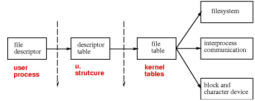

# Pipes

- A pipe allows two processes to communicate with each other 
  - including sending data, more than what signals are capable of.

- ***Files*** and ***pipes*** are two basic inter-process communication (IPC) facilities.
- By default, pipes provide half-duplex ($\neq$ uni-directional),  reliable, flow-controlled, byte stream that can be established only between two related processes.

------

## Half Duplex and Unidirectional

------

- ***unidirectional*** means that the communication channel, there is an input and there is an output.
  - An agent that provides input in the input channel cannot receive data through this input channel.

- ***Half-duplex***, data transmission works in one direction.
  - It's possible to reverse the role of the sender and the receiver using the same channel by
    - clearing the data in channel
    - switching role
      - what used to be a receiver become sender
      - what used to be sender become receiver

- In practice, pipe is used as a unidirectional communication channel.
  - no half-duplex and role switching

------

## Flow Control

------

- Reader is blocked when reading a empty pipe (not closed)
- Writer is blocked when writing a full pipe until there is space to insert more bytes.

------

## Descriptors 

------

- Pipes are not ***name objects***. 
  - a special type of pipe, FIFOs, named objects  
- They are managed through a kernel ***descriptor table***
  - each entry in the table is indexed by a small integer, ***descriptor***
  - All I/O is done through such descriptors (Chapter 3.10, APUE)



- A process obtains a descriptor either by *opening* an object, or by inheritance from the parent process.

- By default : 0 = `stdin`, 1 = `stdout`, and 2 = `stderr`
  - these keywords are defined to be `FILE *` that can be passed into high level I/O

------

## I/O Functions

------

- Low Level I/O (check IPC-pipes pdf)
  - no kernel interference and offering
  - all functions take in `fd` as arguments (and return `fd`)
  - require user to provide buffer and its size
- High Level I/O (check IPC-pipes pdf)
  - require `FILE *stream`, pointer to a `FILE` stream

------

## I/O Redirection

------

- we are allowed to close the `stdin`, `stdout`, or `stderr`,  and reallocate the corresponding descriptor to some other file (or pipe)
  - `stdin` has `fd` 0
  - `close(0)` close that `fd`, slot 0 is now available in the `fd` table
    - no longer associate with `stdin`

- **Note :** open() uses the ***lowest available descriptor***.

```c
close(0); open("/tmp/myfile", O RDONLY, 0);
```

- we can also create a second reference to an existing descriptor

  -  if `oldfd` already exists then

    ```c
    dup2(oldfd, newfd); close(oldfd);
    ```

  
  - replaces `oldfd` with `newfd`, without closing the object referenced by `oldfd`
  - More accurately, content in `oldfd` is copied into `newfd` because `oldfd` and `newfd` can exist at the same time
  - man7 : allocates a new file descriptor `newfd` that refers to the same open file description as the descriptor `oldfd`.

------

## Creating A Pipe

------

- `int fd[2]; pipe(fd);` two descriptors are opened
  - `fd[0]` for reading
  
  - `fd[1]` for writing
- A read after closing `fd[1]`, and the pipe empties returns 0 (end of file)
  - Process is block when reading a empty pipe that is still open because the writer probably write something into pipe at some point.
  - This doesn't happen to the file. If a file is empty, it's treated as EOF

- A write after closing `fd[0]`, generates `SIGPIPE` to the process
  - A signal handler can be install to handle SIGPIPE

- Multiple writers : PIPE_BUF specifiers the maximum amount of data that can be written atomically
  - If a single writer write less than PIPE_BUF, OS guarantees that the data won't be interleave (written atomically). 


------

#### Example

------

```c
#include <stdio.h>
#include <stdlib.h>
#include <unistd.h>
#include <sys/wait.h>

#define MAXBUF 128

// who | cat - redirect who output to cat
// indirect way to output to stdout

int main ( int argc, char *argv[] ) {
	char buf[MAXBUF];
    int n, status, fd[2];
    pid_t pid;
    
    if ( pipe(fd) < 0) perror("pipe error!");
    if ( ( pid = fork() ) < 0 ) perror("fork error!");
        
    if ( pid == 0 ) {
        close(fd[0]); 
        // child only writes (no read)
        dup2 (fd[1], STDOUT_FILENO); 
        close(fd[1]); 
        // stdout = fd[1]
        // stdout is still open
        // After input into who, who outputs it into
        // stdout. stdout refers to fd[1] so who actually 
        // outputs to the write end side of the pipe
        
        // who program
        // when execl successfully, the image of who will 
        // overwrites the image of child process in the 
        // memory. The new image is still inherits the 
        // same file descriptor before the image display
        // , which are stdin and stdout
        if ( execl("/usr/bin/w", "w", (char *) 0) < 0 )
            perror( "execl error!" );
    } else {
        close(fd[1]); 
        // parent read only (no write)
        while ( ( n = read( fd[0], buf, MAXBUF ) ) > 0 ) 
            write(STDOUT_FILENO, buf, n);
        	// this is actual stdout, it write to display
            // parent doesn't call dup2 to refers stdout
            // to fd[0] and fd[1].
        close(fd[0]);
        waitpid(pid, &status, 0);
    }
    
    return 0;
}
```

------

## FIFOS

------

- FIFOs are half-duplex channels, managed by  the descriptor table (in fact, may be implemented as  special files).
- FIFOs transfer data in the memory. IPC works between unrelated processes as long as they are in the same machine :
  - possibly multiple writers (synchronization?), and a single  reader.
- Unnamed pipe can't do this because it requires processes to related each other (parent and child).
- `mode_t mode` : file permission (r w x) for user, group, others
- Access: using file operations (e.g., open() , read() ,  write() , etc.)
- By default, an open-for-read (with no corresponding  open-for-write ) blocks a process.
- A write (with no open-for-read) generates SIGPIP

