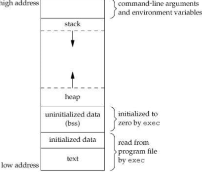
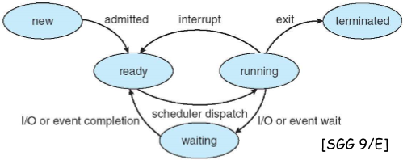
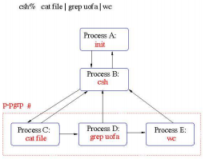
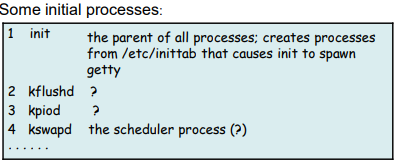
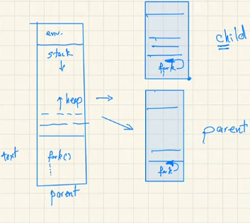

# Processes

- *Process* is a program executing in some environment.

------

## Memory context

------



- ***initialized data* and *text segment*** are loaded in the memory after calling command in the family of "exec" command on a program file.
- ***text segment*** are usually instruction of the program.
- **Global variables** are in initialized data blocks
- **Non initialized global variables** are allocated in ***uninitialized data segment*** in runtime
- Variables **declared in the function** are allocated in ***stack segment*** in runtime
- ***Stack segment*** starts from high memory. Segment grows down to low memory.
- **Dynamic** variables are allocated in the ***heap segment***.
  - **Global variables** that are allocated dynamically, using *new*, *malloc* and so on, are also in ***heap segment***.
- The arrangement of ***stack*** and ***heap segment*** maximize the use of main memory.
- The **values of arguments input** from the shell when launching the program are in the ***top segment***
- Variables defines in initialization shell file (*.bashrc* and similar) are also in the **top segment** when the program is executed

------

#### Exercise

------

- How to expand a process' stack ? *setrlimit* to expand the process' stack

  ```c++
  #include  <stdio.h>
  void foo (int n) {
      int i, a[5], *b;
      // &i - address of i
      // a - address of first element of array a
      // b - address of first element of array b
      
      if (n == 0) return;
      b = new int[n];
      printf("foo(%d): &i = %p, a = %p, b = %p\n", n, &i, a, b);
      foo(n - 1);
  }
  
  int main() {
      foo(3);
  }
  ```

- Output

  ```
  foo(3): &i = bffff9a4, a = bffff990, b = 80497f0
  foo(2): &i = bffff964, a = bffff950, b = 8049800
  foo(1): &i = bffff924, a = bffff910, b = 8049810
  ```

- Memory Arrangement
  - stack (n = 3) (high address to low address) : i, a[0] ... a[4], b 
  - stack (n = 2) : i, a[0] ... a[4], b
  - ...
  - heap (n = 3) (low address to high address) : b[0] ... b[2]
  - heap (n = 2) : b[0] ... b[1]
  - ....

- Anyway : a process  $\neq$ a program $\neq$ a job
- Change the base of address for the stack and heap provide security 

------

## A Conceptual Framework

------

- Process states

- Process data structures (for a process control block, PCB)

  - PCB contains all relevant information about the program

- Process queues

  - keep track of process sorted by their states

  

------

### Process states

------

  - new state - process is created, and acquires resource
  - ready state - process is runnable but not yet executed
    - scheduler (process "sched") selects one of the *ready* or *runnable* process, and give that process the control of CPU
    - scheduler performs *context switching* between processes
    - process state switches to running state

  - running state
  - If a process is interrupted, or requires I/O or waits for some event,  kernel will have the control, then kernel will give the control the scheduler. It is up to the scheduler to decide
    - give the CPU control to another process, and switch the current process' state to ready

------

### Process Data Structures

------

- Process state – running, waiting, etc
- Program counter – location of instruction to next execute
- CPU registers – contents of all process-centric registers
- CPU scheduling information -- priorities, scheduling queue pointers
- Memory-management information – memory allocated to the process (virtual and main memory)
- Accounting information – CPU used, clock time elapsed since start, time limits
- I/O status information – I/O devices allocated to process, list of open files

------

### Process queues

------


- Queue is constructed by linked list
- How does it work ? (Textbook page. 112)

------

## Processes in 4.4 BSD UNIX 

------

Compare with conceptual implementation

- SIDL - *new state* (by a fork() system call), still in the state of acquiring resources
  - intermediate state after creation
- SRUN - *runnable / ready* state (has enough resources)
- SSLEEP - *wait* state 
  - waiting for an event (Example, an I/O operation)
- SSTOP - not in conceptual layer
  - stopped (by a signal, or a parent process)
  - how to bring back to SRUN ?
- SZOMB - *terminated* state
  - intermediate state in process termination
  - exit states (some integer, like 0) need to return to parent
  - PBD is not deleted until its exit states are returned to parent
- Not explicit *running* state, more detailed are in *flags* being encode to represents this state

Typical Life Cycle in 4.4 BSN UNIX


------

### Process Data Structures

------

- 4 data structures
- Two are *memory resident*
  - **process** struct
    - a table with several categories
    - information for decision making of control transfer for scheduler
  - **text** struct
    - information about text segment (read only area) of the program
    - text segment are shared between processes
- *Memory resident* - important information
  - reside in the memory to prevent delay
  - remain the same all the time
- Two are *movable to disk* - less important
  - **user** struct
  - **process page table**

------

#### Process Struct

------


- process priority  [ 0 (highest) to 127 (lowest) ] is computed by the following number
  - p_pri - when running in kernel
  - p_userpri - when running in user
  - p_nice
  - p_cpu
  - p_slptime
- **pid** : unique **id**. for a process
- **p_ppid** : unique **id**. for the parent
- **p_pgrp** : the **group id**. number
  - a process - group (a job) is a **collection** of related processes assigned the **same** process-group identifier.



------

#### Process Structure Queues

------

- *run queue* : a doubly linked list, organized by the process-scheduling priority, of runnable processes.
- *sleep queue* : a hashing table storing blocked processes waiting for certain events.

------

#### User Struct

------

- May be swapped out from memory
  - Value of the information in current execution state loses if struct is swapped to disk unless the page is swapped back to main memory.
- The Current Execution State (important  information): program counter,  registers, status word, stack limits, virtual memory
- State related to *system calls*
- *Accounting* information

------

### Process Creation

------



inittab - init table

------

#### fork()

------

- child process inherit parent's space
  -  spawns a child process with a copy of the parent’s space (text, data, bss, stack, open files, environment variables, etc.)
-  returns 0 to the child (process space);
-  returns p_pid > 0 to the parent (process space).



- Check (OSS Page.117)

------

#### execl() and execv() 

------

- replace the process’ space by a new executable image
- cause **no change** in the p_pid

------

#### Example of fork()

------

```c
#include <stdio.h>
#include <stdlib.h>
#include <unistd.h>

int main(void) {
    pid_t pid;
    int i = fork(); 
    /*
    	call fork(). fork() return value to child space and 
    	parent space individually.
    	
    	In child space, fork() return 0
    	In parent space, fork() return p_pid of child
    	 process, p_pid > 0
    */
    
    printf("Return of fork() : %d\n", i);
    
    pid = getpid();  
    for ( ; ; ) {
        printf("Hello, my name is %d!\n", pid);
    }
    
    return 0;
}
```

- The child may have access to the parent's global variables since the child  has a complete image of its parent. If the parent make modification of those variables, the child cannot access those variables.
- To distinguish the child and parent based on the id number, parent's id is usually smaller than child's id.

------

#### Example of fork() and wait()

------

```c
#include <stdio.h>
#include <stdlib.h>
#include <unistd.h>
#include <sys/wait.h>

#define NLINES 10

int i;
int status;

pid_t pid;

int main(void) {
        pid = fork();

        if (pid == 0) {
            	// child process
                for (i = 1; i < NLINES; i++)
                        printf("%d. I am the child!\n", i);
        } else {
                // wait for its child process to terminate
                // wait for the exit status of child
                wait(&status);
				// parent process
                for (i = NLINES; i > 0; i--)                
                        printf("%d. I am the parent!\n", i);
        }

        return 0; // exit status for both child and parent
}
```

------

#### pkill

------

- processes are not terminate and killed after *exit* commands

```bash
pkill -u $USER * # kill the process belong to USER
```

------

### Process Termination

------

- Normal Termination : execute `return()` from main, `exit()` , or `_exit()`
  - -1 and other return statuses are still considered normal termination
  - logical errors and other kinds
  - `exit()` terminate program with cleanup whatever the processes like to cleanup
  - `_exit()` terminates program from kernel
  - check APUN 7.3
- Abnormal Termination : execute `abort()`, receive a nasty signal
- Normally, a process waits for its children to terminate (the parent **receives a signal** to this effect) :
  - a ***zombie*** is a child that terminates with no waiting parent;
  - an ***orphan*** is a child whose parent has terminated while the child is still running.


------

## Daemon

------

- *Daemon* is a program (process)
- doesn't attach to display and keyboard
  
- All communication with daemons process use inter process communication in main memory, or inter process communication involves internet socket
  
- name of the process usually ends with "d"

------

## Important Processes 

------

- **pageout** (page daemon) keeps track of the page (virtual memory and main memory).
- **Csh** is a shell program 
  - interacts with user after taking login information and authentications from the users,
  - provides command line interface
  - include a programming language
- **getty** is a process that can prompt out and allow users to enter the login information

