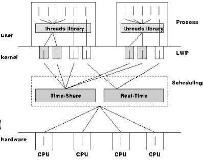

# Threads

- A thread is defined as a flow control inside a process
- Threads are unit being receive attentions instead of processes 
- Consider a communication-intensive application
  - What happens if it awaits a user input?
    - It blocks
    - loses its cached code
    - may be swapped out to disk (from memory) (put in wait state / sleep state)
    - The above cause virtual memory page miss.
      - It tries to read the content in logical space but it is not present in physical space (main memory)

------

## Definition

------

- A thread is basic unit of CPU utilization
- A thread comprises the following that define the "state" of a thread
  - a thread ID
  - register state (PC, stack pointer, etc.)
  - a stack
    - shared stack among threads does not work
    - thread switching with invoking functions together arise confusion
    - shared heap is allow since it uses allocate methods and return pointers
  - signal mask
    - high level software interrupt 
  - priority
  - thread-local storage
    - avoid some issues such as threads modify a shared global variable (e.g. error number `errno` ) without proper synchronization 
- A thread shares with other threads belonging to the same process its code section, data section, other OS resources (open files, signals, etc.) 

------

## Out-of-kernel Solutions (User-level Threads)

------

- Examples : the C-Thread package. Offer different implementations :
  - coroutines in a single process (run in non privilege mode)
  - separate process for each thread, using inherited shared memory

------

### Disadvantage

------

- Scheduling is difficult. 

  - Schedule timer for the scheduler provided from the packages use the kernel clock (a service provided by the kernel). 

  - Kernel clock $\neq$ CPU clock (Real Time Clock - RTC)

  - Schedule timer in the library is much slower than RTC

- Non-preemptive scheduling

  - a thread continue to works until it's blocked
  - If a thread is blocked and there is left over in the time allocated process
  - Coroutine scheduler takes control and switches to another coroutine

- Preemptive

  - Coroutine scheduler decide at what instance to switch a coroutine to another (regardless a coroutine is running or not)

------

## Case Study : Threading on Sun Solaris

------

- Solaris provides :
  - Out of kernel support - typical coroutine packages
  - kernel support - light weight processes (LWPs)



------

### Thread creation in Solaris

------

```c
#define _REENTRANT
#include <thread.h>
#include <stdio.h>
#include <unistd.h>
#include <string.h>
#include <stdlib.h>

/*
	A thread is defined by a head function.
	A head function is passed as a argument to thr_create()
	to create a thread. This head function is the main 
	function of that thread.
*/

void *athread(void *arg) {
    printf("Thread ID: %2d, arg: %s\n", (int)thr_self(), 
          (char*)arg); // thr_self() return thread ID
    return 0;
}

int main(int argc, char *argv[]) {
    int i;
    for (i = 0; i < argc; ++i) {
        int n;
        n = thr_create(NULL, // stack base, an address
                       0, // stack size, address offset
                       athread, // main function for a thread
                       (void *)argv[i], // pointer to the argument wanted to pass into the thread's function
                       THR_DETACHED, // flag
                       NULL // flag
                      ); // n -> return errno
        if (n) {
            fprintf(stderr, "thr_create: %s\n", strerror(n));
            exit(1);
        }
    }
}
```

- After creating a new thread, there are two thread :
  - main thread, terminate when terminating the main program
  - new thread by `thr_create()`, terminate when head function return

------

## POSIX Threads (pthreads)

------

- POSIX defines an API, not an implementation

- Example declaration - check APUX textbook

  - Declarations

    ```c
    #include <pthread.h>
    pthread_t tid; //thread identifier (int or struct
    pthread_attr_t attr; //thread attributes: e.g., thread
    // stack address and size
    ```

  - Get default attributes

    - `pthread_attr_init (&attr);`
    - `&attr` is an input and output parameter
    - once `&attr` is passed, it can be accessed and changed

  - Create a thread

    - `pthread_create (&tid, &attr, start_routine, arg)`