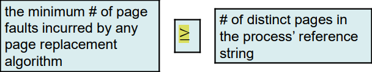

# Virtual Memory

## Background

---

- **Virtual memory** : separation of logical memory as perceived by users from physical memory (Page 398 - 399)
- **Virtual address space** : refers to the logical / virtual view of how a process is stored in memory (Page 398 - 399)
- 

- Shared pages (Page 400)

---

## Demand Paging

---

- **Load pages only as they are needed** (Page 401)
  - similar to paging system with swapping
- **Lazy swapper**

---

### Basic Concepts

---

- **Pager guesses** which pages will be used before the process is swapped out again.

---

#### Valid-Invalid Bit (Page 402)

---

- valid, the associated page is both legal and in memory
- invalid, the page either 
  - is not valid (not in the logical address space of the process)
  - or is valid but currently on the disk

---

- Access a page not brought into memory
  - **Page fault**
- Procedure for handling the page fault (Page 403) and some important requirement (Page 404)
- Extreme case :  start executing a process with **no** pages
  - Programs tend to have **locality of reference**

---

### Performance of Demand Paging

---

- effective access time = (1 - p) $\times$ memory-access time + p $\times$ page fault time
- Sequences cause by page fault (Page 406)
  - Three major components : 
  - service the page-fault interrupt
  - read in the page
  - restart the process
- effective access time is directly proportional to the **page-fault** rate (Page 407)

---

## Page Replacement

---

- Increase degree of multiprogramming, over-allocating memory.
- If there are enough pages, it's fine to do so
- But this is not always the case because a particular part of process is required result increase in number of pages for each process.
- I/O buffer consume memory too.
- => memory-placement algorithms
  - distribution of memory between I/O and programs

---

#### Example

---

- A process with 10 pages but only use half of them (5 pages)
  - Demand paging will only bring in 5 pages
- Let consider running forty pages (a process with 10 pages),
- instead of running 4 processes, run 8 because 8 $\times$ 5 = 40

---

###  Basic Methods

---

- Basic Page replacement procedure (Page 411)
- Enhancement : dedicate to swap out the modified page to increase performance

---

## Page Replacement Algorithm

---

- Frame-allocation algorithm and page-replacement algorithm
- For pure demand paging
  -  
- Algorithm success criteria :
  - Fast and inexpensive
  - Minimizes the # of page faults for many applications
- **RAND**
  - Select a random victim, with preference to unmodified pages.
  - Easy to implement, yet unpredictable.

---

### FIFO Page Replacement

---

- create a FIFO queue to hold all pages in memory.
- replace the page at the head of the queue.
- when a page is brought into memory, insert it at the tail of the queue.
- Advantage :
  - easy to implement
  - requires no special hardware
- Disadvantage (Detail : Page 414) :
  - pages that are actively used 
  - requires a dynamic queue data structure
  - Belady's anomaly

---

### Optimal Page Replacement

---

- Replace the page that will not be used for the longest period of time.
  - the lowest possible page-fault rate for a fixed number of frames
  - Never suffer from Belady's anomaly
- Example : Page 415
- - Disadvantage :
  - difficult to implement 
    - because it requires future knowledge of the reference string

---

### LRU Page Replacement

---

## Page Allocation

---

- How to allocate the fixed amount of free memory among various process
  - A simple strategy for a case study (Page 422)

---

### Minimum Number of Frames

---

- Allocation of frames with constrained.
- Must allocate at least a **minimum number of frames**.

---

### Global vs. Local Allocation

---

- Page 424

---

## Thrashing

---

- Process does not have the number of frames it needs to support pages in active use
  - => page-fault
- Must replace some page
- However, since all its pages are in active use, it must replace a page that will be needed again right away.
  - page-fault rapidly happen because replacing pages that it must bring back in immediately
- **Thrashing**, high paging activity

---

### Causes

---

- 
