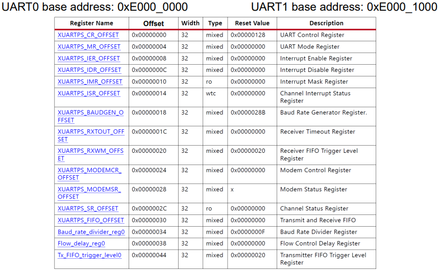
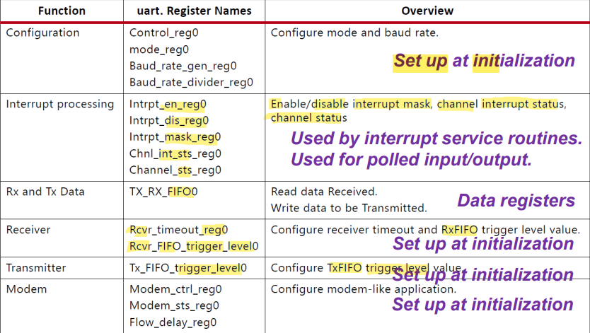

# Chapter 06

- **serial** : send information one bit at a time.
- **peripheral** : a piece of equipment, such as a printer, that can be connected to a computer.
- 7-bit data format : ASCII
- 8-bit data format : Binary
- Flexible can also introduce complexity at the same time (reoccurring scene).
- Pins in MIO can configure to different peripheral registers. Peripheral registers can connect to FPGA using EMIO.

------

## Issues using cache with I/O Peripherals

------

- Cache hierarchy can fool the developers.
- Registers in **I/O Peripherals** are hardware registers.
  - They're difference compared to memory location.
  - **I/O Peripherals Registers** are also called volatile location.
- When CPU hold a copy (in cache) of the content in I/O Peripherals registers, and I/O Peripherals registers make change, the change does not reflect direct into the copy the CPU holding, i.e., the CPU is still using the old data.
- When CPU hold a copy (in cache) of a memory location, this is fine because CPU is the one which issues changes. Cache will also be reflect the change along with main memory.

------

## UART

------

- Trigger Interrupt in RxFIFO and TxFIFO : alter CPU to consume the byte in the FIFO once the number of bytes in the FIFO reach specific threshold.
- Filling up RxFIFO and TxFIFO is critical : CPU must consume the bytes in the FIFO otherwise it will lose the new upcoming data.
- UART Interrupt Control
  - Interrupt enable register is 1 for bit a, and Interrupt disable register is 0 for bit a. Interrupt mask register is 1 for bit a.
- Latched - must be cleared before use; Unlatched - can be used / changed immedately 
- Zynq UART driver provides easy interface to access information of UART hardware

------

### UART Registers

------

Description of UART Registers 

Overview of the UART Registers

------

### UART Implementation

------

- init - page 43.
- transmission 
  - poll - page 44.
  - IRQ - page 45
- receiving
  - poll - page 46.
  - IRQ - page 47.

------

## Serial Peripheral Interface (SPI)

------

- 