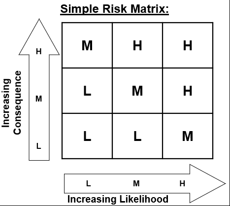

# Acceptable Level of Risk

## Every Activity Has Associated Risks

---

- Everything we do **involves risk** and the **acceptance of some level** of risk
- Different types of risk
  - walking on the sidewalk versus climbing a high ladder
  - Climbing a ladder is a high hazard activity
  - Walking on the sidewalk is not a high hazard activity
- Even an activity is a high hazard activity, it's not **necessarily** a **high risk** activity.
- **High hazard potential** does not equate to high risk.
  - You can apply control measures to the **high hazard** activity 
    in order to **reduce the risk** to an **acceptable** level
    - Reduce the likelihood
    - Reduce the consequence
    - Reduce both
    - Reduce (control) or eliminate the hazard
  - Implement to safeguards

---

## The Simple Risk Matrix

---

- For any given level of risk for an activity, 
- there must be a decision about the activity based on its risk level
  - High - “do not proceed”
  - Medium - “do not proceed until further protective measures are applied”
  - Low means “proceed with caution”
- If deemed too high, management direction will dictate how to reduce risks (likelihood and consequence) for a given activity

---

## Management Direction

---

- Every organization will have a set of management directions.
- Up to interpretation
- Depends on risk tolerance of the organization
