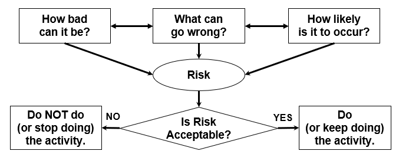

# Risk, Likelihood and Consequence

- **Risk** is a **function** of **consequence** and **likelihood**

- Hazards help inform us about "**What can go wrong**"

  - derive risks from hazards

- Consequence is “**How bad it can be**” 

- Likelihood is “**How likely it is to occur**”

- Estimate both **consequence** and **likelihood** to determine “Risk”

  

- If the **level of risk** is not acceptable, the following can be done
  - Reduce the likelihood
  - Reduce the consequence
  - Eliminate the hazard

---

## Example of Risk

---

- Operating a high-pressure natural gas transmission pipe-line through a city

  - Not construction or maintenance

- Sources of Energy : flammable gas and pressure

- One main risk, leak.

  - A leak originates with a breach in the integrity of the pipe wall by any number of causes

- The leak can result in many other possible outcomes

  - no ignition and dispersal
  - immediate ignition and a fire
  - delayed ignition and a vapour cloud explosion

- Factors increasing likelihood

  

- Factors increasing 

  
