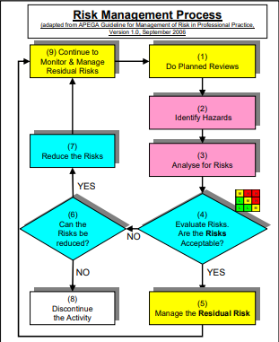

# Model of The Risk Management Program

- The program is to
  - Assess and reduce risk
  - Manage residual risk
- Three components
  - RM Work Process
  - RM System
  - Control Measures

---

## The Risk Management Work Process

---

- RMWP is to identify, assess, and reduce risk.

- First analyzes risk to PEAP

  - What are the chances of it happening? ***Likelihood***
  - How bad could it be? ***Consequence***

- Then systematically assesses that risk against what is acceptable
  - To **reduce risk** to PEAP

- Tools : Risk Matrices, Risk Criteria Tables, Management Directions

- Consequence and likelihood forms combinations

  - range of possible incidents that can happen

  

- Step 3 : Likelihood and Consequence

- Step 4: The risk matrix

- Step 5 : Ongoing process

- Step 6 : Risk Management Direction

- Step 7, 8, 9 : Manage the risks

---

## The Risk Management System and Elements (Page 59)

---

- RMS & E is to control and manage residual risk
  - residual - remaining after most of something has gone
- A risk management system consists of a set of topics or elements 
  - that **narrow the scope of risk management** to particular topic.

- These elements enable managers to
  - systematically understand the risks an organization has
  - systematically manage their operations around these risks to prevent incidents

- Refers to APEGA Model

---

## The Risk Management System

---

- A framework for leadership to **control** the **residual risks** of their organization’s activities
- **defines** how an **organization is managed** on a daily basis
- **documents** the **policies, work processes, and procedures** by which and through which 
  - people **execute** their tasks and **fulfill** their duties
- **complies** with requirements or regulations stipulated by 
  - governments, industry associations, or the organization’s corporate policies
- It's ***pro-active***.
- Example - university calendar, etc.

---

### The APEGA Model (Page 60 - 78)

---

- Management Leadership, Commitment and Accountability
- Risk Assessment and Management of Risks
- Community Awareness and Emergency Preparedness
- Management of Change
- Incident Reporting, Investigation, Analysis and Actions
- Program Evaluation and Continuous Improvement
- Design, Construction and Start-up
- Operations and Maintenance
- Employee Competency and Training
- Contractor Competency and Integration
- Operations and Facilities Information and Documentation.

---

## The RM System vs. RM Work Process

---

- RM Work Process **directs** managers to
  - identify risks
  - determine acceptability
  - define and implement control measures to reduce the risk to an acceptable level
- RM Work Process doesn't explain **how to effectively** manage and control **residual risks**
- The RM System using its Elements explains
  - how to manage and control the residual risks of different activities within the organization.
- There are many different variations that are equally valid and widely practiced in industry, governments, and agencies.

---

## Control Measures

---

- Encompass two types
  - Engineering Controls
  - Administrative Controls

---

### Engineering Controls

---

- An engineered system with specific design intent to **control / mitigate** a **hazard** and **manage a risk** to an **acceptable level**.

---

### Administrative Controls

---

- A documented plan for the ***safe execution*** of work: 
  - policies, procedures, SOPs, JSAs, best practices, and check-lists
- **Specifies a safe plan** for the **safe execution** of  work in the form of policies, procedures, and best practices
- Policies and procedures are **well-defined**
  - establish actions to safely and efficiently execute work
- Best practices are based on 
  - the skills and knowledge of trained
  - competent workers in their field of expertise
- Example
  - operating procedures
  - maintenance procedures
  - training requirements
  - etc.

---

#### The Hierarchy of Administrative Controls

---

---