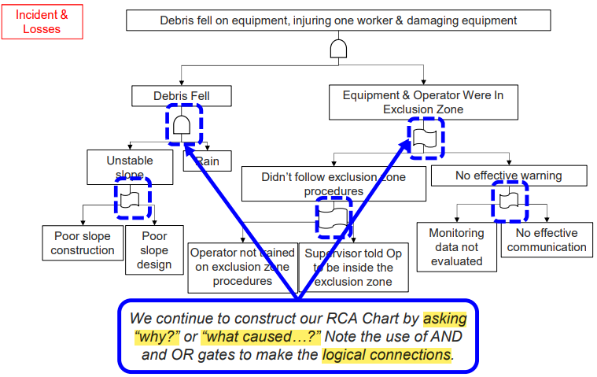

# RCA WP and CE

- The *causation* of a loss incident must be explained in **rational** and **sequentially logical terms** in order to 

- make sense 
- and be of value in **determining** the *latent causes* of a loss incident
- Avoid the following
  - "jumping to conclusions"
  - "logical leaps"
  - etc.

---

## RCA WP -  Mining Loss Incident

---

### Description (Not a Incident Description)

---

- You are called to a scene where a mining haul truck and a shovel have  been crushed with debris from an adjacent slope.
- You find one  individual with a severe injury.
- You know 
  - the slopes are being  monitored,
  - there are procedures for safe work near the  slopes, 
  - it has been raining for the last week.
- The losses
  - People injured
  - Equipment value
  - Operation time loss
  - Public image
  - Ore loss
  - Environmental impact

---

### Incident Description & Causes (Non-categorized)

---

- **Incident Description** (Starting point)
  - The slope of an open quarry slid down, 
  - debris fell on equipment adjacent to slope causing injury,
  - equipment loss, and production loss.
- **Causes**
  - Debris fell from the side
  - Slope was unstable
  - Truck and shovel were inside the exclusion zone
  - Supervisor told Operator to work in the exclusion zone
  - Operator was not trained on exclusion zone procedures
  - Monitoring data was not evaluated

---

### RCA Work Process

---

- **Collect the facts**, complete as much of the *Incident Investigation WP* before moving on to the *RCA WP*
  - necessary that **facts** of the incident **are known** 
    - especially **the sequence** of events leading up to the incident.
  - Time and effort can be saved by avoiding debate driven 
    - by lack of information, 
    - or lack of consensus on plausible events.
- **Apply the** *RCA WP* **to logically breakdown** the loss incident to identify the cause of an incident, including
  - *immediate causes*
  - *basic causes*
  - *latent causes*
  - construct the *Root Cause Analysis Chart*
- Identifies **actual** causes as well as **possible, probably, plausible, or conceivable** causes.

---

#### Purpose of RCA WP

---

- Intended to drill down to the latent causes. 
- Once latent causes (RMS element weaknesses) are identified,
  - needed improvements & recommendations become evident. 

---

#### Starting Point of RCA WP

---

- **Incident Description**
- Describes the **sequence of events** leading up to the incident - **in detail**

---

#### Product of RCA WP

---

- ***RCA Chart***

---

#### Suggestion When working RCA WP

---

- Focuses on one specific cause at a time.
- Identifies all causes through brainstorm thinking, 
  - supported by evidence  in actual loss incidents under investigation
- Provides a visual representation of the incident in a clear an logical manner.

---

### How to Construct RCA

---

1. Define and state the Incident Description. 
2. Ask “what caused this?” <=> “Ask why?”
3. For each subsequent cause, ask the same question, “why?”
4. Immediate causes at the initial levels, followed by basic causes
5. Use "AND" and "OR" gates to logically connect causes
6. Continue to drill down to ultimately discover the latent causes
7. Build sound logic in the RCA Chart - avoid "logic leaps"
   1. Use the narrative technique : 
      1. "This ... was caused by this ... . This ... was caused by this ... ."

---

### "AND" and "OR" Gate

---

- **"AND" Gate** - Practice (Condition) A $\and$ Practice (Condition) B
- **"OR" Gate** - Practice (Condition) A $\or$ Practice (Condition) B

---

#### In The Context Of Mine LI

---

---

### Apply the Discovery Approach In An RCA

---

- Energy Source ?
- Line-of-Fire ?
- Lack of or No Safeguard ?

---

## Cause and Effect Model

---

### Five Components

---

- Losses (PEAP)
- Incident Description
- Immediate Causes in two sub-categories
  - Substandard practices and sub-groups
  - Substandard conditions and sub-groups
  - an *immediate cause* can **caused by** another *immediate case*
- Basic Causes in three sub-categories
  - Engineering & Design Factors
  - Job Factors and sub-groups
  - Personal Factors and sub-groups
- Intermediate cause
  - a cause statement that cannot be readily categorized as any one of IC, BC, or LC.
  - can **link** an *immediate cause* to a *basic cause*
  - but if it can clearly be categorized and sub-categorized as an *immediate cause*, then it is quite acceptable

- Latent Causes

---

### Immediate Cause

---

- Technical Factors
- circumstances that immediately precede an incident

---

### Basic Cause

---

- The provided list in the slide is not **all-inclusive**

  

  - Sub-sub-categories of causes along similar lines can be added
  - If you cannot find a sub-category that is a direct match, it is acceptable to create another unique sub-sub-category

- **Difficult to Identify** *basic causes*

  - often not **evident** **until** after an incident has been investigated and analyzed

- Two questions to ask to get the Basic Causes

  - Why did that <u>substandard condition</u> (*immediate causes*) exist?
  - Why did that <u>substandard practice</u> (*immediate causes*) exist?

- There may be *intermediate causes* or more *immediate causes* between the 

  - **first** *immediate cause* and the **first** *basic cause* in a root.

---