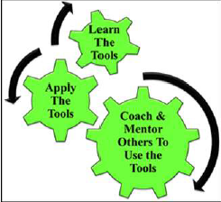
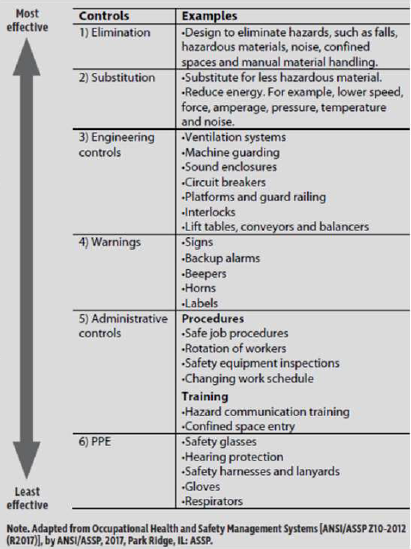
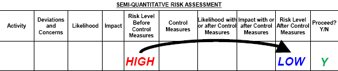

# Chapter 5

## Introduction to Tools to Reduce Risk  for Risk Management

---

### Goals

---

- ***Tools*** for leadership in risk management and their purposes
  - CCOHS Job Safety Analysis Model
  - Checklists for Executing Work
  - Multi-layered Approach to Hazard / Risk Assessment
  - Reporting and Correcting Sub-standard Conditions and At-Risk Behaviours (Sub-standard Practices)
  - Job Observations and Planned Inspections
  - Field Level Risk Assessment
  - Semi-Quantitative Risk Assessment
  - Job Observations and Planned Inspections (Audits)

- Resolve risk concerns by applying a ***risk reduction hierarchy***
- How to ask ***open-ended questions***

---

### Risk Reduction Tools

---

- Basic approach
  - “What are you doing?” (Activity)
  - “What can go wrong?” (Hazards and Risks)
  - “What are you going to do about it?” (Control Measures)
- Detailed Approach
  - Any risk assessment methodology answers these questions in order to identify control measure to reduce risk to an acceptable level :
    - What are you doing? (Activity)
    - What could go wrong? (Hazard)
    - How bad could it be? (Consequence)
    - How likely is it to happen? (Likelihood)
    - Is it acceptable? (Risk)
    - What can I do about it? (Controls – Admin or Eng’g)
    - How does the control change the L and C? (Reduce, remain unchanged, or increase?)

---

#### Example

---

- Activity : *cooking noodle soup for lunch* and it needs to be done carefully to *prevent burning yourself*
- Key activity: holding pot of boiling soup
- Hazard or risk: hot handle, burn hand on hot handle
- Control measure: use a pot holder or oven mitt.

---

### Asking Open-ended Questions

---

- “Help me understand the work you are doing and its hazards.”

- “Can you explain to me **how** your work **is done**, and how to **improve** it?”

- “Can you tell me about the hazards and safeguard that are **associated** with your **work**?”

- Why asking these questions ?
  - Demonstrates management commitment and leadership (#1 MLCA)
  - Coach in a visible and effective manner (supportive, not adversarial, not confrontational).

  

---

## The Fundamental Approach to Control All Risks

---

### Goals

---

- Two different approaches for a Risk Reduction Hierarchy
  - AB OH&S Code Part 2 Hazard Assessment, Elimination, and Control
  - ANSI Z10-2012: Risk Reduction Hierarchy & Hierarchy of Effectiveness
- Apply the two different approaches to **identify, evaluate, and select** the most effective risk reduction solution(s).
  - the most effective safeguard / control measure

- Order of effectiveness is ***not*** an order of priority.

---

### AB OH&S Code Part 2

---

- The **AB OH&S Code Part 2 Section 9** specifies the **order of effectiveness**, a basic approach of a Risk Reduction Hierarchy:
  1. Eliminate
  2. Apply Engineering Controls to Reduce the Exposure
  3. Apply Administrative Controls and Work Practices to Reduce the Exposure
  4. Use PPE
  5. Use combinations of above.

---

### ANSI Z10-2012: Risk Reduction Hierarchy & Hierarchy of Effectiveness

---

- Has same order as AB OH&S but includes *substitution*

  

- ***Order of effectiveness*** $\neq$ ***Priority***

  - One prioritize PPE because it's easy and cheap but it is not th e

- It can be combinations of them

  - Apply engineering controls - encompasses substitute, isolate / separate, engineer
  - Apply admin controls - organization an procedures (policy for when one need to wear PPE)
  - PPE - work practices

  

---

#### Example

---

- Potentially tie in Fernie example with regard to engineering controls (substitute, isolate, engineer)
- Replace the brine with ethylene glycol (antifreeze)
  - substitute, or replace the ammonia with Freon
- Use a more corrosion resistant heat exchanger (shelled tube?)

---

## Field Level Risk Assessment (FLRA)

---

### Goal

---

- Purpose of the Field-Level Risk Assessment (FLRA) Tool
  - a Risk Management tool
- The manner in which FLRA is used
- The benefits for planning work using the FLRA
- Applying FLRA as a rudimentary skill of leadership...

---

### Recall

---

- [The Discovery Approach]: ..\chapter-2\why-RM.md
- Fundamental Approach
- Risk Matrix and Risk Criteria

  - They are used with FLRA

---

### Purpose of an FLRA

---

- Assess, and eliminate or control hazards before starting to work.
- Used immediately before starting the task or job at hand.
- Share and communicate the nature of the job and its hazards.
- Ensure understanding of the control measures.

---

### Basic Steps to Create an FLRA

---

1. Identify job and scope.
2. Determine job steps (major tasks, or tasks not anticipated in the JSA/SOP if being used).
3. Identify hazards associated with the job steps.
4. Determine risks posed by each hazard.
5. Identify suitable control measures for each hazard
6. Determine risk level after or with control measures.
7. Most importantly, communicate / share the FLRA with co-workers.
8. Implement control measures, execute / perform / do the job.
9. Continually re-assess risk through-out the job.

---

#### Example 

---

---

### Summary

---

- FLRA Used immediately prior to starting work
- FLRA is one of many different risk assessment tool
  - Forms come in may different formats, columns, column names, etc.
- FLRA systematically identifies hazards associated with any activity, the risk levels,
  and specify the appropriate control measures.
- FLRA can be complemented with the application of incident models i.e. knowledgebased
  and discovery-based approaches for hazard identification.

---

## Semi-Quantitative Risk Assessment (SQRA)

---

### Goal

---

- Purpose of SQRA Tool
  - the manner in which it is used
  - the benefits for planning work using the SQRA
- Demo. the integration of the SQRA with
  - the Risk Management Work Process and its tools
  - Matrix, Criteria Table, Management Directions)
  - RM System
  - Control Measures
- Application

---

### Integration of The RM Work Process & Control Measures

---

- RM Work Process Function
  - Analyzes risks to PEAP
  - Systemically assesses risk opposite what is an acceptable level
  - uses tools such as
    - Risk Matrices
    - Risk Criteria Tables
    - Management Directions
    - SQRA
- For RME #2 RA & MR, SQRA is a standard
- Control Measures
  - **The SQRA** is used to define and implement the CM's to reduce and control risks to an acceptable level

---

### Purpose and Application of SQRA

---

- It is used to 
  - assess hazards of an activity, job, or task, or installation or facility, 
  - to determine appropriate control measures in order to eliminate or control those hazards.
- It is used during the planning stages of the activity, job,or task, or during the design and construction of the installation or facility.
- It is used to ensure understanding of the control measures (to elminate or mitigate the hazards) by 
  - the personnel preparing job plans, procedures, designs packages, and construction packages.

---

### The Basic Steps of Create an SQRA

---

- Ask three basics questions
  1. What are you doing ?
  2. What can go wrong ?
  3. What you going to do about it ?
- Detail
  1. Identify job and scope
  2. Determine <u>key activities</u>
  3. Identify deviations and concerns associated for each key activity
     - Use the “What-If Analysis” to determine any deviations and concerns!
  4. Determine <u>likelihood</u>, <u>impact</u>, and <u>risk level</u> posed by each deviation / concern without or before control measures.
  5. Identify suitable control measures for each deviation / concern
  6. Determine likelihood, impact, and risk level posed with or after control measures.
  7. Determine whether to proceed with the activity or not.
  8. Incorporate or integrate the control measures in the job plan or engineering / design / construction package.
  9. During or after the job plan is being executed, or after engineering / design / construction, determine the effectiveness of the control measures.

---

#### Example

---

- Notice the difference between 
  - implementing control measures to decrease the likelihood versus
  - those employed to decrease consequence
- A control measure can decrease the likelihood, the consequence or both.

---

#### A Practical Application

---

- 
