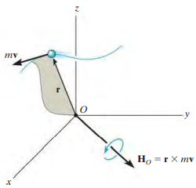

# Angular Momentum

- The "moment" of the particle's linear momentum about $O$.
  - Analogous to finding the moment of a force about a point
- $\boldsymbol{H}_O$, ***Moment of momentum***.

---

## Scalar Formulation (Page 280)

---

- If a particle moves along a curve lying in the x-y plane, 

- *Magnitude* of $\boldsymbol{H}_O$ (15-12)

- *d* is the moment arm or perpendicular distance from $O$ to the line of action of m**v**.

- The *direction* of $\boldsymbol{H}_O$ is defined by the right-hand rule.

- The curl of the fingers of the right hand indicates the sense of rotation of m**v** about $O$

  

---

## Vector Formulation (Page 280)

---

- If the particle moves along a space curve, 

- Cross product

  - $\boldsymbol{r}$, position vector drawn from point O to the particle

  

---

