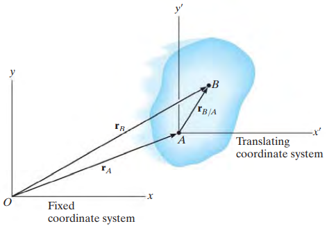
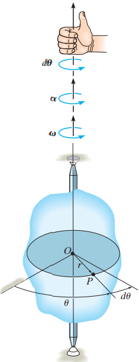

# Planar Rigid-Body Motion

- *Planar motion* of a body occurs when all the particles of a **rigid body** move along paths 
  - which are **equidistant** (equally far or close) form a fixed plane.

---

## Type of Rigid-body Planar Motion

---

### Translation

---

- occurs when a line in the body remains **parallel** to its **original orientation** throughout the motion.

- *rectilinear translation*, paths of motion for any two points on the body are **parallel lines**

- *curvilinear translation*, paths of motion are along **curved lines**

  

---

### Rotation about a fixed axis

---

- a rigid body rotates about a fixed axis, all the particles of the body

  - except those which lie on the axis of rotation,

- move along circular paths

  

---

### General Plane Motion

---

- combination of *translation and rotation*

- The translation occurs within a reference plane.

- The rotation occurs about an axis perpendicular to the reference plane.

  

---

## Translation

---

### Position

---

- A fixed x, y reference frame to define locations of any two points on the body with position vector

- A translating x', y' coordinate system to define *relative-position vector*

  

- $\boldsymbol{r}_B=\boldsymbol{r}_A+\boldsymbol{r}_{B/A}$ (1)

---

### Velocity and Acceleration (Page 346)

---

- Take time derivative of (1)
- magnitude of relative velocity vector is *constant* by definition of a rigid body
- the body is translating, the direction of relative position vector is also *constant*
- velocity of two points equals
- *All points in a rigid body (subjected to either rectilinear or curvilinear) translation* ***move with the same velocity and acceleration***.

---

## Rotation About A Fixed Axis

---

- When a body rotates about a fixed axis, any point *P* located in the body travels along a *circular path*.

  

- Notice that angular velocity and acceleration are all about the motion / rotation of the lines / entire rigid body.

  - Not about point P

- Velocity and acceleration of P are obtained through the angular velocity and acceleration.

- Notice that $\boldsymbol{r}_p$ is not $\boldsymbol{r}$ that originates from $O$

  - $\boldsymbol{r}_p$ is directed from *any point* on the axis of rotation to point *P*

---

### Angular Motion

---

- Since a point is without dimension, it cannot have angular motion.
- *Only **lines** or **bodies** undergo angular motion*.

---

### Angular Position

---

- The *angular position* of *r* is defined by the angle $\theta$, measured from a ***fixed*** reference line to *r*

---

### Angular Displacement

---

- change in the angular position
  - differential d$\boldsymbol{\theta}$ is a **vector**
- Since motion is about a *fixed axis*, the direction of $d \boldsymbol{\theta}$ is **always along this axis**.
- The *direction* is determined by the right-hand rule
  - fingers curled with the sense of rotation
  - thumb points outward from the page, $d \boldsymbol{\theta}$ (from top)
  - both $\theta$ and  $d \theta$ are counter clockwise

---

### Angular Velocity (Page 347)

---

- Time rate of change in the angular position, $\boldsymbol{\omega}$.
- The directional sense of $\boldsymbol{\omega}$ is outward from the page.

---

### Angular Acceleration (Page 348)

---

- Time rate of change of the angular velocity
- The line of action of $\boldsymbol{\alpha}$ is the same as that for $\boldsymbol{\omega}$.
- The sense of direction depends on whether $\boldsymbol{\omega}$ is increasing or decreasing.

---

### Motion of Point P

---

- Point *P* travels along a circular path of radius *r* with center at point *O*.
- The velocity vector of *P*
  - direction is *tangent* to the circular path
  - cross product of $\boldsymbol{\omega}$ and $\boldsymbol{r}_p$ also yield the same direction, *tangent* to the circular path
- Acceleration
  - *Tangential component*
    - time rate of change in the **velocity's magnitude**
    - same direction / opposite direction of **v**
  - *Normal component*
    - time rate of change in the **velocity's direction**
    - always toward $O$
