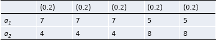

# Decisions Under Risk

- In decisions under risk, the decision maker  knows the probabilities of each state.
- The main rule to apply is the principle of maximizing expected utility.
- The main rule to apply is the ***the principle of maximizing expected utility***.
  - EU = $p_1\cdot u_1 + p_2\cdot u_2 + ... + p_n \cdot u_n$

------

## Principle of Maximizing Expected 

------

- The main rule to apply is the principle of maximizing expected:
  - monetary value
  - value
  - utility
- EMV = $p_1 \cdot m_1 + p_2 \cdot m_2 + ... + p_n \cdot m_n$
- EV = $p_1 \cdot v_1 + p_2 \cdot v_2 + ... + p_n \cdot v_n$
- EU = $p_1 \cdot u_1 + p_2 \cdot u_2 + ... + p_n \cdot u_n$
- It is not necessary that **it is irrational** if a person does not follow / a person violates the principle of maximizing expected monetary value if there are other values a person need to consider and evaluate.
  - **Not just money**

------

## Marginal Value

------

- Winning more is always better than winning less. However, the more one wins, the lower is  the value of winning yet another million.

------

## Utility

------

- Not all concepts of value are reliable guides to rational decision making.
- The *utility* of an outcome depends on *how valuable* the outcome is from the decision maker's point of view.

------

## Maximizing Expected Utility

------

### The Law Of Large Numbers

------

- A mathematical theorem : everyone who maximizes expected utility will almost certainly be better off ***in the long run***.

  

- If a random experiment is repeated ***n*** times, and each experiment has a probability ***p*** of leading to predetermined outcome,

- then the probability that the percentage of such outcome ***differs*** from ***p*** by more than a ***very small amount*** $\varepsilon$ **c*onverges*** to ***0*** as the number trails ***n*** ***approaches infinity***.

- This holds true for every $\varepsilon > 0$, no matter how small.
- Hence, by performing the random experiment ***sufficiently many times***, the probability that the average outcome differs  from the expected outcome can be ***rendered arbitrarily small***.
- In the ***long run***, the actual outcome approaches the expected number.

------

#### Example

------

- Example: You are offered 1 unit of utility for sure or a lottery ticket that will yield either 10 units with a probability of 0.2, or nothing with a probability of 0.8.

  |           | (0.2) | (0.8) |
  | --------- | ----- | ----- |
  | Lottery A | 1     | 1     |
  | Lottery B | 10    | 10    |

- EU (A) = (0.2 * 1) + (0.8 * 1) = 1

- EU (B) = (0.2 * 10) + (0.8 * 0) = 2

------

### Problem of The law Of Large Numbers

------

- No real life decision maker will ever face any decision an infinite number of times.
- It is not acceptable that a decision 
- maker ever faces the very same decision problem several times.
- Many decisions under risk are unique
  - Marriage
  - Presidential election
  - Attending a graduate school

------

## The Axiomatic Approach

------

### Indirect Axiomatization

------

- Propose a set of axioms (structural constraints), such as transitivity and asymmetry
- **Show** that if a decision maker’s preferences over a set of risky acts are **consistent with these axioms**, a decision maker **behaves as** if that decision maker **tries to maximize expected utility**.

------

### Direct Axiomatization

------

- There are four direct axioms. 
- By applying four direct axioms, it can prove the principle of maximize expected utility.
  - However, this cannot prove that a decision maker is actually following it.

------

#### Axiom 1

------

- If all outcomes of an act have utility u, then the utility of the act is u.

|       | $s_1$ | $s_2$ | $s_3$ | $s_4$ |
| ----- | ----- | ----- | ----- | ----- |
| $a_1$ | 9     | 9     | 9     | 9     |
| $a_2$ | 4     | 4     | 4     | 4     |

- U ($a_1$) = 9
- U ($a_2$) = 4

------

#### Axiom 2

------

- If one act is certain to lead to better outcomes **under all states** than another, then the utility of the first act exceeds that of the latter; 
- If both acts lead to equal outcomes they have the same utility.

------

#### Axiom 3

------

- Every decision problem can be **transformed** into a decision problem with equally probable states, in which the **utility of all acts is preserved**.

  |       | 0.6  | 0.4  |
  | ----- | ---- | ---- |
  | $a_1$ | 7    | 5    |
  | $a_2$ | 4    | 8    |

  

------

#### Axiom 4

------

- If two outcomes are **equally probable**, and if the **better** outcome is made **slightly worse**
- then this can be **compensated** for by **adding some amount of utility** to the other outcome, such that the overall utility of the act is preserved.
- Trade-off principle

- There is some number δ >0, such that for all $\epsilon$ , 0 ≤ $\epsilon_1$ ≤ δ , there is a number $\epsilon_2$ such that the suggested trade off is unimportant to you, i.e. the utility of the original and the modified acts is the same.

## Paradox

------

- Rare and extreme cases that exploit the weak spots of the principle.
  - Principle is still useful in usual case.

### Ellsberg's Paradox

------

### The St. Petersburg Paradox

------

- The are several other games with infinite or arbitrary expected utilities.
- In general, they point to two problems:
  - That their expected utilities are infinite or arbitrary.
  - That they are not comparable.

------

### The Two-Envelope Paradox

------

- You are offered a choice between two  envelopes, A and B, each of which contains  some money. One of them contains twice as  much as the other.
- Since you don’t know which envelope contains  more money, you decide to pick one at  random, say A. Just before you open it, you  are offered to swap and take B instead
- What would you like to do?
- At first, you picked A containing x. Now, B has  to contain either 2x or x/2. Since the  probabilities of both possibilities are equal,  the expected monetary value of swapping to B  is (1/2) · 2x + (1/2) · (x/2) = 5x/4 .
- So, the principle recommends that you should  switch to B
- What about swapping to A again?!

------

