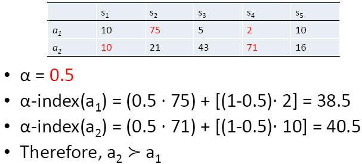
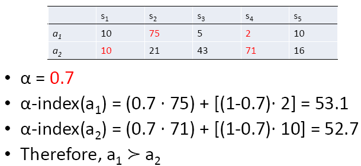
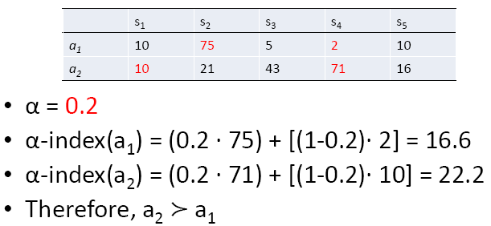
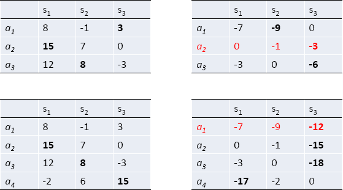
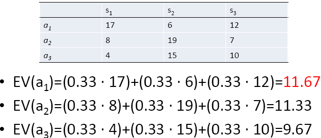

# Decisions Under Ignorance

- In a decision under ignorance, the decision maker :
  - **knows** what the alternative *acts* and possible *states* are, and what outcomes they may result it, but
  - **unable** to **assign** any *probabilities* to the states corresponding to the outcomes
- Ordinal scale is sufficient when we are going to apply the dominance.
- There are no difference between *principle* and *rule*.

------

## Notation

------

- The notations represent the rationality relationship between two acts instead of numbers.
- ≻ - succeed
- ≽ - equal to
- ∼ - similar
- $a_i$ ≻  $a_j$ : it is **more rational** to perform the act $a_i$ rather than the act $a_j$.
- $a_i$ ≽ $a_j$ : the act $a_i$ is **at least as rational as** the act $a_j$.
- $a_i$ ∼ $a_j$ : the two acts are **equally rational**. 

------

## Dominance Principle

------

- Dominated acts must not chosen.
- Dominated acts : *acts* 
  - whose all outcomes under every state are **at least as rational as** other outcomes of other acts under every state
  -  **and** there are some outcomes under some states are **less rational** than outcomes of other acts under those states
- Let $v(a_i, s_j)$ be the **value of the outcome** corresponding to the act $a_i$ and the state $s_j$.
- Notice if one act **does not dominate** another act in **one state** while it can **dominate another act** in **others state**, 
  - the **domination process** terminate

------

### Weak Dominance

------

- ***Weak Dominance*** : $a_i$ ≽ $a_j$ if and only if $v(a_i, s) \geq v(a_j, s)$ for every state s. 

------

### Strong Dominance

------

- ***Strong Dominance*** : $a_i \succ a_j$ if and only if v($a_i$, $s_m$) $\geq$ v($a_j$, $s_m$ ) for every state $s_m$, and there is some state $s_n$ such that v($a_i$, $s_n$) > v($a_j$, $s_n$).

------

### Advantage and Disadvantage

------

- It can also be applied to decision under risk.
- It cannot always single out an act as the most rational.

------

#### Example

------

  - Neither a3 nor a4 are dominated each other because $v(a_4,s_2) > $

------

## Maximin Principle

------

- When decision makers cannot choose an act that is more rational among other acts by using *Dominance* *Principle*, 
- The maximin principle focuses on the ***worst*** possible outcome of each act.
- One should ***maximize*** the ***minimal*** value obtainable with each act.
- If the **worst possible outcome** of an act is **better than** the **worst possible outcome** of another act, the **first** act should be chosen.
- This should not be used in ***decision under risk***.

- Formally speaking : $a_i \succeq a_j$ if an only if min($a_i$) $\geq$ min($a_j$).
- If the minimum value corresponding to the outcomes of two or more acts are the same, the maximin principle ranks the acts as equally rational.

------

##  Leximin Rule

------

- Extended version of *Maximin Principle*
- Let $min^1(a_i)$  be the value of the worst outcome of act $a_i$,
- $min^2(a_i)$ be the value of its second worst outcome,
- In general,$min^n(a_i)$ be the value of its n-th worst outcome

- $a_i$  $a_j$ if and only if there is some positive integer n such that
  - $min^n(a_i) > min^n(a_j)$
  - regardless $min^m(a_i) = min^m(a_j)$ for all m < n

------

#### Example

------

------

## Maximax principle

------

- The maximax principle focuses on the best outcomes.
- Rationality requires us to prefer alternatives in which the best possible outcome is as good as possible.
- You should maximize the maximal value obtainable with an act.

## Optimism-pessimism principle

------

- A decision maker’s degree of optimism can be represented by a **real number** α between 0 and 1.

- α = 1: maximal optimism

- α = 0: maximal pessimism

- max ( $a_i$ ) : the best outcome of act $a_i$

- min ( $a_i$ ) : the worst outcome of act $a_i$

  

- The value of act $a_i$ = [α · max($a_i$)] + [(1 - α ) · min($a_i$)]

  - $\alpha \cdot max(a_i)$ is optimism part on act $a_i$
  - $(1-\alpha) \cdot min(a_i)$ is pessimism part on act $a_i$

- α is a subjective interpretation

- α : an agent’s optimism index
- [α · max($a_i$)] + [(1 - α ) · min($a_i$)] : an act's α-index (subjective)

- Principle definition : $a_i > a_j$ if and only if α-index ($a_i$) > α-index ($a_j$)
  $$
  [\alpha \cdot(a_i)] + [(1-\alpha)\cdot min(a_i)] > [\alpha \cdot(a_j)] + [(1-\alpha)\cdot min(a_j)]
  $$
  
- If $\alpha=1$, evaluate $\alpha$-index  $\rightarrow max(a_i)$ which means the optimism pessimism rule
  collapses to the maximax rule.
  
- If $\alpha=0$, evaluate $\alpha$-index $\rightarrow min(a_i)$ which means the optimism pessimism rule collapses to the maximin rule.

- Note that, in order for this rule to work, the value of outcomes should be measured on an interval scale.

- Is it rational to focus just on the best and the worst cases?

- Determine a series of $\alpha$, $\alpha_1$, $\alpha_2$, ..., $\alpha_n$, such that $\alpha_1+\alpha_2+...+\alpha_n=1$, then define $\alpha$-index of an act $a_i$ as
  $$
  \alpha_1 \cdot max^1(a_i) + \alpha_2 \cdot max^2(a_i) + ... + \alpha_n \cdot min(a_i)
  $$

- then choose the act with the **greatest** $\alpha$-index

- Note that $\alpha_1$, $\alpha_2$, ..., $\alpha_n$ are ***not probabilities***
  - similar to (subjective) **probabilities**
  - but not ***equivalent to*** **probabilities**
- They are chosen only according to how **much importance** the decision maker attaches to the best, the second best, ..., and the worst outcome of each act.
- The **relative importance** of an outcome **doesn’t necessarily** **correspond** to its probability.

------

#### Example

------

------

## Minimax Regret

------

- The best alternative is one that **minimizes** the **maximum** amount of regret.
- $a_i \succ a_j$ if and only if the maximum regret of $a_i$ is less than the maximum regret of $a_j$, or to put it formally :

$$
max\{(v(a_i, s_1)-max(s_1), (v(a_i, s_2)-max(s_2)), ...\} < max\{(a_j,s_1)-max(s_1),(v(a_j,s_2)-max(s_2)), ...\}
$$

------

### Procedure

------

- The value of regret for each outcome is calculated by subtracting the value of the **best outcome** of **each state** from the value of the
  outcome in question.
  - This obtains the ***regret matrix***
  
- The act chosen based on Minimax Regret principle is an act whose maximum regret for all states is minimum among other acts for all states.
  - Find the maximum regret for each act.
  - Choose the act with the least maximum regret.

------

## Irrelevant Alternatives

------

- The ranking of the alternatives cannot be changed by adding a non optimal alternative.
- In other words, the **addition** of a new act, which is **not regarded as better** than the original ones, should **not change** a rational agent’s ranking of the **old acts**.

- Minimax regret violates the axiom of *Irrelevant Alternatives

------

- The ranking of the old acts is changed. $a_1$ is the best act rather $a_2$ in the original one after $a_4$ is added.

------

## The principle Of Insufficient Reason

------

- If one has no reason to think that one state of the world is **more probable than another**, then all states should be assigned **equal** probability.

- By applying the principle of insufficient reason, an initial decision problem under **ignorance** is transformed into a decision problem under **risk**.

- If one advocates the principle of maximizing expected value as the best rule for decisions under risk, then the principle of insufficient reason can be stated as:

- $a_i \succ a_j$ if and only if $\sum_{x=1}^{n}\frac{1}{n}v(a_i,s_x)>\sum_{x=1}^{n}\frac{1}{n}v(a_j,s_x)$

  

  

  

- Problem: it makes a decision problem very sensitive to how the states are individuated.

- Problem: if one has no reason to think that one state is more probable than another, does it follow that the probabilities are equal?

