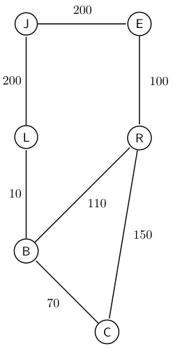
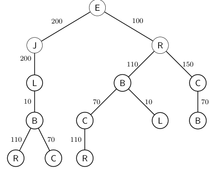

## Misc
---
- Applications Domains of searching and planning in AI
  - Path finding (e.g. GPS)
  - Games
  - Logistics
  - Puzzles
  - Learners
- Relationship between search and planning methods:
  - Classical planning and heurisitc search are related
  - Constraint Satisfaction and local search are related
---
## State-Space Search Problems
---
### Informal definition via example
---
- The task of finding a path on the city map is a search problem.
  - a starting location (e.g., university)
  - a goal location (e.g., airport)

- Each location the agent (e.g. a driver) in the city map is a **state**.
  - The **inital state** is described as "the agent is at the university"
  - The **goal state** is described as "the agent is at the airport"
  - The **path** from the university to the airport goes through multiple **states** (e.g., different streets)
    - connected by **actions** (e.g., make a right turn on Whyte Ave)
- The space of states and actions as a whole is the **state space**, which can be represent as a *graph*.
  - Circles (Vertices) $\rightarrow$ states
  - Lines (edges) $\rightarrow$ actions that are available
- In a state space, two states $s_1$ and $s_2$ are connected with an edge
  - if there is an action that can take the agent from $s_1$ to $s_2$.
- Each action has a cost (shown by the edge weights)
- The **optimal solution** $\rightarrow$ path with shortest path.
  - If not, an suboptimal solution
---
### Formal Defintion
---
- A search problem is defined with tuple: $(G, s_{init}, s_g, T, C)$, where
  - $G$, state space 
  - $G = (S, A)$ is a graph with 
    - the set of vertices $S$ and
    - the set of edges $A$ defining the relation between states
  - $s_{init}$ or $s_0$ in $S$ is the inital state
  - $s_g$ in $S$ is the goal state
  - $T$, **transition function** (or successor function)
    - receives a state $s$ in $S$ and
    - returns a set of states $s'$ that are connected to $s$ with an edge in $A$
       - $(s, s')$ is an edge
       - $(s, s') \in A$  
  - $C$, **cost function**
    - receives an edge in $A$ and
    - return the cost of the action the edge represnts 
    - $C(s, s') = c$ where $c$ is cost of the edge between state $s$ and $s'$
      - E.g., $C(E,R) = 100$ represent the cost of edge between Edmonton and Red Deer.
---
### Properties
----
- Transition function and cost function are originated from the graph / state space.
- Size of the state space $=$ Number of available states in a search problem
---
### Vacuum cleaner example
---
- A search problem can have multiple of goal states as long as each goal state satifies the goal of the problem.
  - Not all gloal statse are necessary optimal.
- In this context of this example, the goal is to have both rooms free of dust. 
  - The final location of the robot is not important.
- For *some problems*, it is easier to specify a set of goal conditions as poopsed to a specify a set of goal states.
  - Number of goal states can be large. 
---
## Search Tree
---
- The algorithms taught in this class generate a **search tree** to solve a search problem.
- The search tree is rooted at the inital state $s_0$
- The next level of the search tree is given by the states that 
  - can be reached once the agent applies a single action at $s_0$.
  - $s_0$ is the parent node of (child) nodes in the next level of the search tree.
---
### Generation and Expansion
---
- The children of a node $n$ is **generated** when a search algorithm invokes the *transition function* for $n$.
- A node is **expanded** when their children are generated.
---
### Cycles and Transpositions
---

- These two results can harm the performance of the algorithms.
- Ideally, the search tree will be as small as possible.
- Runtime of the search algorithms is well correlated with the size of algorithm's tree.
  - Larger $\rightarrow$ longer
- **Cycles** occurs when the same state appears twice on the same path.
  - R, B, C, R is a cycle
- **Parent prunning** is a solution for elimination of cycles.
  - (Loose definition) Avoid child node of a node $n$ being the parent node of $n$
  - Worst case: cycle is formed by a leaf and the root of the tree.
    - Cost of traversing and finding such a worst case is not necessary linear.
- **Memory** is another solution for elminiation of cycles
  - Remember the states we have visited
- **Transpositions** occur when multiple paths **lead to the same state**.
  - E.g., node B on the path E, J, L, B is a transposition of the node B on the path E, R, B.