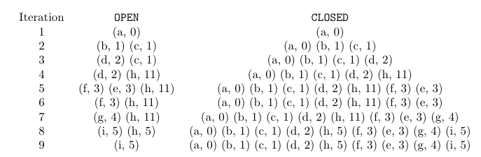

## Uniformed Search Algorithms
---
- Study Breadth-First Search (BFS) and Dijkstra's algorithm
- The entire state space $S$ might not be stored in memory.
- Instead of storing entire state space $S$, start with the following elements
  - start and goal states,
  - a transition function,
  - and a cost function.
- The initial state and the transition function can perform the search without necessary storing all the state space in memory.
  - i.e., state space expands during the runtime by each individual state and a provided transition function
  - begin the search in the start state
  - the transition function can return its neighbors, and the neighbors' neighbors
  - until a goal state is found and returned.
- Things to keep in mind when studying algorithms:
  - completeness
    - it is guarantted to find a solution if one exists 
  - optimality
    - it is guarantted to find an optimal solution
  - time and memory complexities
---
## Breadth-First Search
---
### Algorithm's Overview
---
- It expands all nodes $X$ edges away from the start ebfore expanding nodes $X+1$ edges away the start.
  - i.e., it expands in term of levels (layers) of the search tree.
  - e.g., level 0 $\rightarrow$ start state, level 1 $\rightarrow$ the children of start, etc.
- It enumerates all possible states, level (layer) by level (layer), until a goal state is encountered.
---
### Data Structures
---
- `OPEN`
  - FIFO structure
    -i.e., first node that is stored first in the structure will be expanded first
  - guarantees that the nodes at level $X$ are expanded before BFS expands nodes at level $X+1$.
- `CLOSED`
  - hash table
  - avoid expanding transposition and cycles
    - i.e., stores all states encountered in search
    - BFS will not add it to `OPEN` if it encounters a repeated state.
  - recover the solution path via pointers (references), once one is encountered
    - i.e., store each node $n$ in `CLOSED` and information of $n$'s parent in the BFS search tree.
    - with pointers (references), it can follow these all the way back to the root of the tree to recover the solution path
---
### Algorithm's Procedure
---
- `OPEN` stores all states encountered in search but that were not expanded
- `CLOSED` stores all states encountered in search.
- `OPEN` and `CLOSED` are initalized with the start state.
- BFS then removes it from `OPEN` and adds its children to both `OPEN` and `CLOSED`
- For every iteration
  - a state from the level, which is currently being expanded, is removed from `OPEN`
---
### Pseduo code
---
```python
def BFS(s_0, s_g, T):
  OPEN.append(s_0)
  CLOSED.add(s_0)
  while not OPEN.empty():
    n = OPEN.pop() # pop a node / state n
    for _n in T(n): # _n is n'
      if _n == s_g:
        return path() # path() will return path between s_0 and n', implementation specific
      if _n not in CLOSED:
        OPEN.append(_n)
        CLOSED.add(_n)
```
---
### Properties
---
- Complete because it checks all states encountered
- Optimal iff solution cost is minimal, i.e., all actions have the cost of 1
- Time Complexity:
  - Assume branching factor is constant, i.e., the number of children is constant for all nodes
    - denoted as $b$
  - $d \rightarrow$ depth of the serach tree, i.e., number of levels (layers) of a search tree
  - BFS generates $b$ nodes at level 1, $b^2$ at level 2, ...
  - Total number of nodes generated: $b + b^2 + b^3 + ... + b^d = O(b^d)$
- Memory Complexity: $O(b^d)$
---
### Drawback
---
- BFS minimizes the amount of edges it travel / hop but fails to find optimal solutions in general.
- Action costs often aren't unitary.
---
### Workthrough
---


---
## Dijkstra's Algorithm
---
### Algorithm's Overview
---
### Data Structures
---
- `OPEN`
  - priority queue
    - implementation of a priority queue: heap (particularly binary heap)
      - i.e., node with cheapest value is always on the top of the priority queue (?)
    - e.g. `heapq` in Python
      - insert nodes in `OPEN` in $O(\log{n})$, 
        - $n \rightarrow$ size of the heap
      - retrieve the cheapest ndoe in $O(1)$
      - remove $n$ from `OPEN` in $O(\log{n})$ due to rearrange the heap
    - update a node require reconstruction of the heap strucutre to ensure the heap is still valid.
      - expensive $\rightarrow$ linear in the size of the heap
      - but rarely happen unless there is a better path is found to a state
- `CLOSED`
  -  same data strcutures used in BFS
  -  No side effects in `CLOSED` as the has table dose not depend on the cost of the nodes.

---
### Algorithm's Description
---
- In each iteration, `OPEN` expands the node with **cheapest cost** that was generated but not yet expanded.
- Denote the cost of a paath connecting the root of the tree to node $n$ as the $g$-value of $n$, or $g(n)$.
- When encounter a better path to goal state, update the information about the parent of a state in `CLOSED`
- The algorithm only stops when the goal node, $h$, is removed from `OPEN`.
- Then, recover the path from the root to a goal state using `CLOSED` list in the same way as BFS.
---
### Differences between Dijkstra's algorithm and BFS
---
- BFS uses a FIFO. 
- BFS stops the search when the goal is **generated**.
- BFS always finds the shortest path (in terms of number of actions) to every node when it is first **generated**.
- Dijkstra's algorithm uses a priority queue sorted by the node cost
- Dijkstra's algorithm stops when the goal is **expanded**.
- Dijkstra's algorithm might need to update the path and the cost of nodes in `OPEN`
---
### Properties
---
- Complete
- Optimal $\leftarrow$ expands all cheapest paths before moving on more expensive ones
- Time complexity
  - assume the actions have unit costs such that the optimal solution cost $C^*$ equals the depth $d$ in which the solution is encountered.
  - $O(b^{d+1})$
  - Worst case, all nodes at depth $d$ must be expanded **as** the goal can be the **last state** expanded **at that depth**
    - all nodes at depth $d+1$ are generated
---
### Implementation
---
- Two operations:
  - Find the node with **minimum cost** in `OPEN`
  - Verify if a node was already encountered in search by
    - checking whether the state the node represents is in `CLOSED`.
---
### Pseduo Code
---
```python
def dijkstra(s_0, s_g, T):
  OPEN.append(s_0)
  closed.add(s_0)
  while not OPEN.empty():
    n = OPEN.pop()
    if n == s_g:
      return path() # path() will return path between s_0 and n'
    for _n in T(n):
      if _n not in CLOSED:
        OPEN.append(_n)
        CLOSED.add(_n)
      # if it has found better path
      if _n is in CLOSED and g(_n) < CLOSED[_n].g_value:
        update g(_n) in OPEN and CLOSED
        update parent(_n) in CLOSED
        # update parent of n'
        OPEN.heapify() # reorganize heap structure
```

- The implementation adds the same copy of each node to `OPEN` and `CLOSED`.
  - an efficient way of checking if the algorithm found a better path to a given state due to hash table and pointers (reference)
- What if node $n'$ is in `CLOSED` but not in `OPEN`
  - $\rightarrow$ node $n'$ was already expanded.
  - Dijkstra's algorithm guarantees that when a node is expanded, it is expanded with its value
  - Otherwise, it wouldn't guarantee optimal solutions.
- If $n'$ is in `CLOSED` but not in `OPEN`, 
  - one cannot find a cheaper path to the state $n'$ represents
  - and the second part of the Boolean expression in will always be false.
- Update the value of $g(n')$ in both `OPEN` and `CLOSED` simultaneously.
  - have both structures point to the same object in memory, quick access and update with hash table.
- Update the parent of $n'$ in `CLOSED`.
  - because a better pat from the root of the tree to $n'$ is found, in case the solution goes through $n'$ and the solution path is recovered.
--- 
### Workthrough
---


