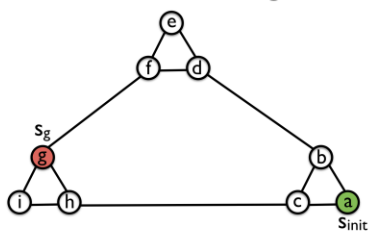
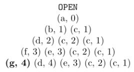
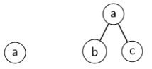
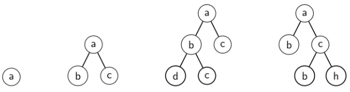
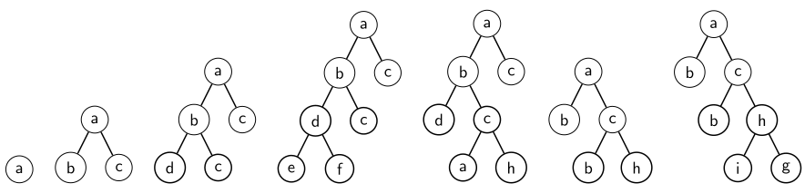

# Uniformed Search
---
- In the **worst case**, both BFS and Dijkstra's algorithm store the entire state space in the memory.
  - memory requirement prohibitive depending on problem's size
  - **exponential** in the solution depth
- Study for a algorithm with a much lower memory requirement
  - **linear** to the solution depth
---
## Depth-First Search (DFS)
---
### Algorithm's Overview
- Dive as **quickly** as possible into the search space
---
### Data Structure
---
- `OPEN`
  - LIFO $\rightarrow$ stack
- No `CLOSED`
---
### Algorithm's Description
---
- Apply parent pruning to eliminate some of the cycles
- `OPEN` starts with the inital state with the cost of 0
- In each iteration of DFS
  - remove the **last state** inserted in the `OPEN`
  - and expand that state just remove from `OPEN`
---
### Properties
---
- DFS is not complete
  - The algorithm will never return form an **infinitely deep subtree**.
- DFS is not optimal
  - See example
- Memory Complexity
  - linear in the search depth
    - only stores the nodes on the expanded path 
    - and the siblings of those nodes
---
### Suggestions for Improvement
---
- Given the solution depth, prune a path that is deeper than the solution depth.
  - E.g., if the solution depth was 3,
  - prune the node $g$ path $a,b,d,f,g$ because the path deeper than the solution depth.
- If a path is deeper than the solution depth, backtrack and try a different path.
- **Problem**: optimal solution depth is unknown for many problems of interest.
---
### Example
---



---
## Iterative-Deeping Depth-First Search
---
### Algorithm's Overview
---
- This strategy will find the solution path with its optimal length (i.e., # of actions)
  - because it enumerates all paths with length $X$ before enumerating all paths of length $X+1$
---
### Algorithm's Description
---
- First, check if the initial state isn't the goal state
  - if it is, then the process is finished
- If the initial state is not the goal state, 
  - guess that the solution depth is 1 and enumerate all paths with length 1
    - i.e., children of the start state
  - search stops once the search encounters the goal
- If the goal state isn't found after enumerating all paths under solution depth is 1
  - guess that the solution depth is 2 and enumerate all paths with length 2
  - same again, the search stops once the search encounters the goal
- This process continues until a goal state is encountered.
---
### Pseudocode and Implementation
---
```python
def Bounded_BFS(n, s_g, T, d):
    if n == s_g:
        return True
    if d < 0:
        return False
    for _n in T(n):
        if Bounded_BFS(_n, s_g, T, d - 1):
            return True
    return False

def IDDFS(s_0, s_g, T):
    d = 0
    while True:
        if Bounded_BFS(s_0, s_g, T, d):
            return True
        d = d + 1
```
- IDDFS receives an initial state, a goal state, and a transition function as input.
- IDDFS calls DFS for increasingly larger depth bounds $d$.
- It starts with $d=0$.
- If the goal is not encountered, it increases the value of $d$ to 1
  - so that DFS enumerates all paths of length of 1.
- The procedure is repeated until a goal state is genreated.

- ***Notes***: 
  - In this pseudocode, the algorithm only returns true of false
    - depending on whether it finds a goal state
  - In order to return the path, one have to collect the states on the solution path
    - as unrolling the recurisve calls once the goal is encountered.
---
### Properties
---
- Time complexities (Use example to reinforce the idea)
  - Considering the number of nodes the algorithm generates
  - Assume a fixed branching factor $b$
    - i.e., number of childrens for each node is the same in the entire search tree
  - Assume the solution is encountered at depth $d$.
  - The children of start state is generated a nummber times $=$ depth $d$
  - The grandchildren of the start state are generated $d-1$ times
  - The great-grandchildren of the start state are generated $d-2$ times
  - etc.
  - Total number of nodes IDDFS generates as there are
    - $b$ children
    - $b^2$ grandchildren
    - $b^3$ great-grandchildren
    - and so on.
  - $db+(d-1)b^2+(d-2)b^3+...+b^d$
  - The summation above is dominated by $b^d$
  - Thus, $O(b^d)$
---
### Example
---








- $b$ and $c$ are generated 3 times, one for iteration
---
### Comparison with BFS
---
- In terms of $O$ notation both BFS and IDDFS have the same time complexity.
- Search tree grows exponentially with search depth grows exponentially with the searh depth
  - The last iteration dominates the algorithm's running time.
- Should IDDFS be used over BFS? ***No***
- IDDFS expands **transpostion**s
  - a problem if the state space allows for a larger # of tranpositions in the search tree
  - due ot no memory to remember the states it has already visited
---
## General Cost Function IDDFS
---
### Algorithm's Overview
---
- Actions have different costs.
- Two small modifications
  - increase the bound $d$ to the **smallest** $g$-value of a node pruned in the previous iteration
  - stop when the goal is **expanded** instead of being generated
---
### Properties
---
- Worst case due to reexpansions (duplicating expansion?)
  - Assume $N$ is the total number of states in the state space
  - If the algorithm only expands a single new node in each iteration
    - check definition in expandsions in `01-Lecture.md`
    - first iteration it expands one node
    - ... two nodes
    - ...
    - The total # of nodes IDDFS expanded can be written as
      - $1+2+3+...+N=N^2 \rightarrow O(N^2)$
- The tree grows very slowly from one iteration to the next (exactly by one new state per iteration).
- Rare case but there are problems in which the re-expansion nodes can be quite harmul for IDDFS.
  - map-based pathfinding
    - cost of 1 to moves in the four cardinal directions
    - cost of $\sqrt{2}$ to diagonal moves
---
### Example
---
- Check lecture note
---